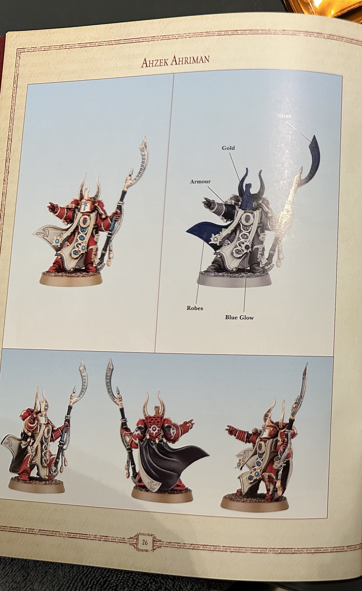
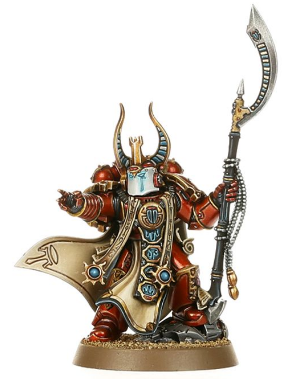

<h4>
第二章 泰坦之子
</h4>

         阿里曼先是闻到了他们对俘虏做的事，然后才亲眼目睹。牢门刚一打开，血液与生肉的腥臭便扑鼻而来。他们把那囚犯扯皮肉坠着，吊了起来。一盏覆满线缆的落地照明灯将他悬垂着的身子浸在昏黄的光里。生锈的挂钩刺透了他的后背与手臂，双手的皮肤已不见踪影。赤裸在外的血肉试图愈合着，流泣着苍白的液体。一只充满血丝的眼，在阿里曼踏进牢房时，定定地将目光落在他身上。他们取走了另一只眼，阿里曼注意到。鲜血淌满了那只空洞眼窝下的右颊，一道一道。前额上，两处伤口凝着血块。阿里曼看见两枚金属的钉，在溅满血污的地上闪烁着黯淡的光。

         葛孜瑞尔把俘虏和他的星际战士兄弟们交给了玛罗斯。显然，占卜者决定在打碎那星际战士的意志之前，先尝试着肢解他的躯体。毫无疑问，俘虏手上的皮肤现在正垂挂在玛罗斯的盔甲上。

         “你怎么来了？”俘虏问道，他的声音是喉间一阵刺耳刮擦似的粗哑低吼。有那么一瞬，阿里曼没有回答。他怎么来了？葛孜瑞尔一直不愿让阿里曼接近他最新到手的战利品，可阿里曼坚持着，最后是葛孜瑞尔不情不愿地让步了。那真是耗费了好一番谨慎而精妙的心机，也并非是毫无危险的。他为什么非得冒这个险呢？他原以为是想要搞清俘虏对那场战斗的回忆来着。望着那星际战士饱经折磨、沐满鲜血的残损面容，他思忖着自己是否还心存别的动机。

         “你还记得什么？”阿里曼问。恶魔现身之后，葛孜瑞尔与其他的劫难者突袭了他们。卡洛兹小队中的一些幸存者讲述了那带走了冠军的暗影，还有放逐了它的火。葛孜瑞尔推测着，以为是那俘虏将恶魔焚了。这一壮举打动了劫难者之主；他决定留下俘虏和他的兄弟。他要求星际战士们向他屈膝而从，可他们坚持着不肯屈服。那傲然的反抗让这俘虏落进了这间舱室，令他付出了一只眼睛的代价。

         俘虏嫌恶地撇了撇嘴角，苍白的牙齿在染满血污的肉体中幽幽反射着晦暗的光。

         “我记得我的兄弟死去。我记得他的胸膛裂分开来。我记得亚空间的恶臭。我记得一道暗影。”阿里曼看到俘虏的独眼中闪过一缕微光；他的光晕忿怒般灼亮，暴怒与力量锁束在饱经磨损的意志之后。“我记得，**巫师。**”

         阿里曼点了点头。

         *他知道啊，* 阿里曼想着。*他有看到并知道我的真容。* 他没有武器在手，可那阻止不了他给俘虏封口。他的手指抽搐了一下，感到那念头在亚空间中寻到了一声回响。那会是如此轻易的事。*不，* 他心想。他的心灵平复开来，而亚空间也静了下去。

         “我的主希望得到你的效命。他在你身上感到了强大的力量。”

         “这就是你为什么来这儿的原因么，**巫师**？”再一次地，阿里曼听到了那话语中的恨意。

         “我侍奉我主。”阿里曼说，“你是受过战斗和毁灭训练的灵能者。他喜欢灵能者的誓言，你让他很感兴趣。”

         俘虏微微动了动他敞露在空气里的肌肉，锁链一阵叮当。鲜血从挂钩穿过皮肤的地方奔流而下。

         “你的主人是谎言与无知的奴隶。”夹杂着星星鲜红血斑的唾沫同话语一起吐了出来，“我的誓言属于我自己，不会让付与他。”

         “会有更糟糕的事情的。”

         “有么？对你来说，也许会有的，巫师。你害怕真相，我不需要看到你的脸、亦或听见你的言语，便知晓这点。我不害怕真相，尽管那真相或许会杀了我。”

         *我自己也曾会说出的话啊，* 阿里曼想着。“可是，你还活着。”

         俘虏吃力地发出了一声残忍的、染着血的笑声，把锁链都震得晃动了起来，“是啊，我还活着。你的谎言为我买得了这一瞬苟活。你是想希望为此得到感谢么？”

         阿里曼沉默了片刻，而后伸手将头盔从头上摘了下来。苍蓝的双眼端嵌在一张有着光洁橄榄色皮肤的面容上，凝然迎望着俘虏的独眼和被挖空的眼窝。

         “我的主人相信你很强大，而你的确如此。”阿里曼说。没有了头盔，他的声音低柔清亮，含着深沉的回音。

         “我不是叛徒，我也不会侍奉你的主。”

         “你不是叛徒，可这是一艘帝国舰船中的弃儿。”阿里曼说，“并且，你们身上有着已经破誓之人的印记。”诚然，泰坦之子号乍一看之下，并不像血之新月号那样，是腐朽而堕落的变节者。可它也称不上是迷途的忠诚派。

         “我没有破誓。”

         “然而现在，你就在这里，一个被创造了你的帝国放逐的流亡弃儿。有区别么？”阿里曼问道。

         俘虏啐了一口。染着斑斑血迹的痰液啃噬着金属地面，咝咝作响。

         “对你而言，大概没有吧，巫师。”那俘虏的头松垂下去，垂在胸前，眼皮抿阖了起来。阿里曼点了点头；他再问不出更多了。他转过身，向着监牢门口走去，举起一只手要敲上那黑暗的金属。他顿住了，回过身，望着那俘虏。

         “我为你的兄弟们感到很抱歉。”阿里曼说道，“另外两个还活着，不过能活多久，我说不准。”

         俘虏抬起了目光。阿里曼看到他光晕的坚硬棱角模糊了一瞬，而后断然归复成了钻石般的线条。那俘虏微微点了点头。

         “你叫什么名字，巫师？”

         阿里曼垂眼望着手中的黑色头盔。也许会什么有人还记得他的名字。可他不是阿里曼，也不会再是了。

         “我叫霍尔科斯。”他说。

         那俘虏笑了一下，笑声化作了摧枯拉朽的剧烈咳嗽。

         “又一个谎言。不必担心。你救了我的命。我不想要这个羁绊，但我愿意恪守。我不会揭穿你的谎言。”俘虏停顿下来，吸了一口气，“我的名是阿斯特罗斯，巫师，而我为你的良心保持缄默。”

         阿里曼没有回答，任由那俘虏悬在晦暗里。

 

         劫难者们正在将泰坦之子号据为己有。阿里曼回到自己住处的路途几乎贯穿了整艘六公里长的船。他每走一步，每转过一个弯，都看得又一处劫难者的獠牙在船体间愈咬愈深的痕迹。此前，他们有在拼命地试图唤醒泰坦之子号的系统，可那并没有阻止他们对这舰船的灵魂标上自己的宣称。机仆与受尽鞭挞的群奴已经将战斗造成的屠杀清理干净，却只是为了劫难者们能以更多的屠杀将之取代。血肉烧焦所散发的恶臭与烟尘，在空气里弥漫得浓厚。在敞露的甲板上、还有更为宽广的通道间，阿里曼遭逢了一群又一群的劫难者，聚集在简陋的火盆和尸堆燃起的火焰周围。血肉在火上燃烧，脂肪与皮肤沸腾，黑烟凝成油腻的云雾四下弥漫开来，而劫难者们随之在火焰旁嗥叫着。他们以粗哑的喉音高喊着圣歌，将暗色的液体倾在甲板上以作奉祭。

         阿里曼绕过狂吠的猎群，行走在火光边缘。他闭上了自己的眼与耳，不去听那些嗥叫，不去看那些在焚烧尸体的火堆烟雾中蟠曲的形体。他更变着自己穿越舰船的路线，回避着劫难者聚集的机库与货舱。他想要清空自己的脑海、理清思绪，想要去斟酌、去思考他与阿斯特罗斯间的对话，想要去理明那些凝聚在他思绪边缘、半为成形的推断与恐惧。那些精神训律，曾如此地身为他不可分割的一部分，本可将迅然的澄明给予于他，可它们是他再也无法持起挥驭的工具。他要尝试着、寻觅一处静谧，而在那之中，他或许能寻得一方平静。

         那平静回避着他。即便在侧廊与走道里，他也看到了泰坦之子号的命运正遭变迁的迹象。这舰船似乎没有真正的、活着的人类船员，只有机仆；而劫难者在他眼中所见的一切之上都刻下了痕迹。那些仍旧有着人类面容的，被剥去了皮肤。于是，它们以湿漉漉的、筋与肉的面容，向阿里曼灿烂地咧嘴笑着；那些没有真正面容的，它们的面部被钉覆上了皮肤。于是，它们的视眼传感器便透过那张拉的眼孔与大开的嘴，向外凝视着。他们也从血之新月号上带来了奴隶。那些奴隶们排着长队蹒跚走过，色如死灰的皮肤上，脓汁自烙印间汨汨流泣。他们中的大多数人，终其一生，都在血之新月号上苦苦劳作。拥挤在生活区空间里，呼吸着弥漫满了污染物的雾浊空气，从不曾见过真正太阳的光明，他们存在的意义只为辛劳。那是何其可悲可悯的一种生活啊，并且，这生活也并不会在泰坦之子号上轻松半分。变种人监工们已经在走道和下层甲板间无声巡逻了。他们饱经沧桑的破旧铠甲上闪亮着鲜血湿润的微光，挂悬着那些以某种方式惹恼了他们主人的人的皮肤。
         
         阿里曼已经目睹过这样的事情许多次了，就仿佛对暴行的想象是有限度的一般。那是个他一次又一次在那些跌堕于亚空间之力、为之所征服的人的命运中观察到的真相。最为低等而基础的本性，会最先、也最为强烈地浮现出来，仿佛杂质浮上熔炼坩埚那白热的表面。

         *那我呢？* 他想着，一边匆匆穿过一间立柱林立的货舱。这里也有火堆在燃烧，吟唱的声音在空气中刺耳地咯咯回荡。*我也已经堕落到了这些可怜虫的地步啊，也许还更甚一筹；我凭什么认为自己未曾改变？我不比他们好多少；我们的灵魂被驱使着，一路狂奔，他们的与狂怒共生，我的与狂妄相依。我们都是一样的，无非是堕落的道路有别。*

         “喜欢我的作品吗？”有声音咕噜着从阴影中传来。阿里曼停下了脚步，意识到他刚刚竟让自己身处何地的意识漫游去了不知何方。玛罗斯从一根有着棱沟的金属廊柱旁踏了出来。那占卜者露出了锉得整齐的齿，可没有人会把这表情称作微笑。他一只手松松搭在一把带鞘的剑柄上，另一只手在指间把玩着一串指关节骨。那些指骨晃荡着敲打在他的手甲上，轻声咔啦。阿里曼能在他身上嗅到力量的气息，浓厚的、腐臭的，好似恶魔的呼吸。

         “你的作品？” 阿里曼说，虽然他知道玛罗斯指的是阿斯特罗斯。那占卜者微笑起来，骨头再次在他的指间咔哒作响。

         “我吃了只眼睛。”他说，“你知道么，霍尔科斯，人们曾经认为，吃掉一只眼睛，可以带来智慧？”他耸耸肩，横挂在他肩膀间的鞣制皮肤拍打着战甲的甲片，“我们且等着瞧瞧。倘若我们从他那里取走另一只眼的话，也许你应该试试？”

         阿里曼继续沉默着，他的头恭敬地低着。

         *食眼并不会给人带来智慧，你个傻瓜，* 他想着。*眼目的牺牲者才是得到恩惠的人，而非夺取者。*

         “另外两名俘虏... 唔，好吧，如果他们不向我们躬身屈从，那么，兴许我们可以看看更多的眼睛能干些什么。”

         *倘若是在过去，我本会教导你，让你见识一下你究竟是何等无知的。* 那念头在阿里曼的脑海中冷笑着呲牙咆哮，他不得不拼命挣扎着将它压抑下去。他是霍尔科斯，破誓者，最卑贱的叛徒；他不能有这样的念头。

         “是，主人。”他说。

         玛罗斯咯咯地笑了起来，那声音好似干燥鳞片摇摆时的嘎吱作响。

         “好。随我来。我还有一样东西，希望你欣赏一下。”

 

         阿里曼跟随着玛罗斯，黑暗叠合在他身周，将他笼罩。几分钟后，随着通道愈发狭窄寒冷、防爆门 (blast doors) 愈发厚实，阿里曼分辨得出，他们正向着外层船体进发。最后，稀薄的空气让位于彻彻的无情真空，他们不得不戴上了头盔。像泰坦之子号这样的舰船，会彻底排干它们一部分外层船体中的热量与大气。就像层层的死皮，这些虚空中的冰冷节段提供了对伤害的缓冲，而并不汲取动力。

         是当他们顺着一条无光的通道，向一扇封闭着的门走去时，他才感到自己的皮肤刺刺地痛、才在头盔中的空气里嗅到一种不可能存于此处的酸锐铜味的。他停了下来，双眼紧紧盯着前面的那扇门。那扇门的后面有什么东西，什么辐射着恶意与饥饿的东西，就仿佛高温自铸炉中辐散出来一般。

         “你感觉到了吗？”玛罗斯说着，扭过头来，望着阿里曼。玛罗斯的头盔盔面形如猎犬的口鼻，它的双眼在晦暗中荧荧着无焰的光。在那猎犬龇牙咧嘴的怒容之下，阿里曼确信，玛罗斯正微笑着。

         “那是什么？”阿里曼问道，一动也没有动。他开始一部分一部分封闭起自己的心灵，为他的灵魂披挂上一层层被动防御的护甲。

         “来吧，来看看吧。”玛罗斯说着，向紧闭着的门迈去。那扇门很小，被一道道粗厚的金属加固。玛罗斯双眼红光的照射下，那门扉的表面闪烁起了明亮的碎光。它的表面覆满了污渍似的印记：眼睛、螺旋、犬牙参差的字母、弯钩状的线条，全部以暗色的、如今冻凝的液体胡乱抹成。对阿里曼而言，它们与孩子气的胡乱涂画别无二致。玛罗斯举起一只手来，激活了门锁，拉开了门。

         门后一片漆黑，如此彻彻然的黑暗，以至于它看上去仿佛一眼通往湮没的洞穴。阿里曼能够嗅到腐肉与死水的味道。那恶臭充斥着他的口与鼻，即便并没有空气来传递气息。玛罗斯回过头望了望他，举起一只示意的手，踏了进去。阿里曼顿住了。他浑身上下每一个部分都在尖叫着要奔逃，要转身逃离那候着他的门。可他不能的，他必须要跟上去。玛罗斯不会容许他逃离这启示
<a href="#AhrimanExile-2-1">[1]</a>
。他走上前去，穿过了门。

         黑暗。有那么一秒的时间里，除却在他头盔显示边缘明灭的图标，他什么都看不见。然后，形体现了出来，被苍淡的光线勾勒出了轮廓，尽管此地并无光照。他看见了玛罗斯，那占卜者的脸转了过来，向着他，双眼是钢铁的犬面上一对黯淡的燃煤。另一个身形漂浮在这空间里，摊展的肢体被锁链的罗网束缚着，锁在目不可及的墙壁上。褴褛的破布覆起了它的身体，尽管如此，他依然能看出一位星际战士的体格轮廓与块块肌肉。它面容与双手上的皮肤，是死一样的惨白，毫无毛发。粗糙的缝线游走在它的胸膛上，缝起了肌肉与骨头间，一处参差破碎的裂缝。一条条鞣制的皮肤自它血肉间的针上垂落下来，每一条上都蜿蜒着烧灼其上的印记，那印记在目光落于它们之上时扭动起来。阿里曼在口中尝到了胆汁的味道。那被悬在空中的身影，以曾是双眼的漆黑空洞，回望着他。

         “真壮丽啊，不是吗？”玛罗斯说，传送来的声音蒙着一层静电噪音的锋缘。那生物扭过头来，空荡荡的眼紧紧盯在占卜者身上。

         *跑。现在跑啊，你个蠢货。* 那念头在阿里曼的脑袋里尖叫着。那生物张开了嘴，咧开一抹过于宽大的灿烂微笑，袒露出过于繁多的齿。一条黑色的舌，舔掠过闪烁微光的、针一般的锋利齿尖。它咝咝着：一阵在这不存空气的舱室中，本该绝无可能发出的杂音。

         “卡洛兹斩杀的星际战士。”阿里曼轻声说，声音微细有如呼吸。

         “我想，它名为卡达尔。是的。受了极重的伤，可当它来到我面前时，它最后一丝生命的线还没有被切断。非常强大。”玛罗斯点了点头，仿佛是在表示赞许，“将死的肉体，造就悦心的容器。”

         阿里曼看得出来的：那星际战士的躯体，是一袖血肉的空皮囊；它的灵魂被挖舀了出来，而它的形态，是一副皮肉的假面。一只恶魔盘绕在所余的残缺虚壳里，那灵魂的实质暗夜般漆黑，缓缓向外漾溢着饥渴与恶意。它并无智慧；只是纯粹的本能与欲望。玛罗斯施于其身的束缚将它固定就位，好似大头针将昆虫固定在桌上。阿里曼错判了那占卜者；他无知而粗始，可他已经习得、又实践了阿里曼不相信他有能力掌握的知识。这成就所结出的果，乃是至为可憎可恶之物。

         他从那生物身上移开了目光，看见玛罗斯正看着他。

         “它是我的，并且只回应我。”玛罗斯说道。

         *他想要我看看它，* 阿里曼想着，*看看他统御的力量。于他，仅仅是挥驭起这力量，是不够的。必须要有其他人来见证它、来惊叹敬畏于此。* 他鞠下躬来，鞠得很深、很低，心中知晓着这便是玛罗斯所期待的事情。他的上方，那造物咝咝吐息着。*这便会是他用来摧毁葛孜瑞尔、夺取劫难者的武器了。他带我来，是为了测试它的效力么？我就要成为它第一个受害者了么？*

         玛罗斯任由阿里曼跪着，跪了很久很久。

         “平身，霍尔科斯。”

         阿里曼立起身来，望进玛罗斯红色的眼。*不，* 他想道。*我是他的第一个盟友。*

         “现在，你看到了。”玛罗斯说罢，转身离去。他的身后，阿里曼跟随着，感觉着那生物空洞的目光盯落在他后脑勺上。

 

         阿里曼独自一人回到了他的新住舱。葛孜瑞尔将这方空间赏给了他，可它有多是一种对侍奉的赏赐，便有多是一种细细算计出的蓄意侮辱。宽广与狭小同时并存一处，这空间与其说是舱室，不如视作舰船结构上留下的一处空隙。一面墙壁矗立着，直耸入上方的黑暗，表面覆满了铆钉与焊缝。其它的墙以不同的角度、于各异的高度与之相接。一条条管道穿过这整个空间，仿佛匆匆地急着去往其他更为重要的地方。那些管道，有的足有人高，有的纤细更甚手指；它们一捆捆地在地板上蜿蜒蛇行，藤蔓一般爬满了整个空间。他点燃了几碗机油的灯盏，浓厚的、边缘染着红色的光自火焰中漾溢着，涌了出来。舱室里弥漫着温热金属、油烟、与陈滞空气的恶臭。灰色的油污与尘埃覆满了地面，厚厚的一层，在他穿过圆形的舱门时，将他的脚步声模糊得闷闷然。他仰头望去，目光直直望入那纠缠管道的天幕之外，一片晦暗的黑。空气、冷却剂、燃料、水和废料，全都在那长达六千米、足以容纳三万灵魂的舰船这被遗忘的裂缝里奔涌。他立在这儿，立在这舰船的心脏里，却身处一隙被遗忘之地中。这本该是他在劫难者之中地位的标志，然而这孤绝却几乎称得上讨喜的程度。

         他关上舱口，转过身，动作间几乎不曾表露出哪怕最轻微的、半点疲惫的迹象。他的头一阵阵痛着，那被束缚生物的存在萦绕在他心里，仿佛一块淤青似的，挥之不去。有那么一刻，他思索着，思索着阿斯特罗斯；他会保持沉默么？

         倘若他告诉葛兹瑞尔的话...

         劫难者之主不会相信他的。

         或许吧。

         直接给他封口会更好。

         他又摇了摇头。他需要去思索、去反省、去回忆。

         很安静地，他开始轻声念起咒式，感受着音节在口中回响，品味着周围以太中微妙的变化。他一边低语，一边行走着，双脚以步伐描划出一道盘旋的纹样。他已经将灯盏摆置在正确的位置上了，任它们燃着，以备好前路。任何看着它们的人都不会意识到它们的重要性的。它们所构成的图案、他所行的步履、还有他心灵的聚焦，在亚空间中搭建出了一方结构体，将这舱室封闭其中，免于任何观测的窥看。这仪式拉扯着他内心深处、一处他封闭了那样久的地方里的回忆，可他需要隐私。

         空气变得浓厚，充盈着电荷；舱室在他眼前泳动。他听得一声响动，宛如沙子掠动着，扫过干燥的石面。而后，随着最后的一下脚步、一声话语，那舱室骤然折回了现实，重新聚焦起来，而静寂亦随之降临。

         他向着自己点了点头，仿佛要将那信念坚定下来似的。他转过身，转向立在角落里的、一只密封的箱子。当他打开抿紧的金属盖时，尘埃的气息充斥起他的鼻端。一缕缕苍白的织物铺在里面，层层地遮覆在庞大笨重的形体上，它们的形状消散在织物之下，好似皑皑冬雪下的建筑。他将织物扯了出来，望着那静卧其下的。

         并没有多少东西。任何看到它们的人，大约都会以为它们是自战场上、或是被焚毁的神殿中拾来的，破旧的小饰品。一根弯钩为端的杖，表面熏得焦黑、灼起了泡；一尊人手大小的、精刻而成的圣甲虫，曾经打磨得光亮的宝石已经磨损，有着细小的剥落缺痕；一碎抛光的金属，形如橡树的叶。它们的旁边，一顶头盔躺卧在那里，面甲向上望着，以空洞漠然的眼注视着阿里曼。它是红色的。一块失却光泽的铜铸板甲从眼线之上延展到下颚之下，构成了犁状的口鼻，两只绯色的、晶体的眼从中破出。左眼下方流淌着两线墨黑的漆纹，宛若泪痕。一枚分叉的青铜顶冠自前额升起。那头盔落满尘灰、破旧沧桑，就仿佛是在战争结束后被扯了下来，弃在那里，任由它埋在一层尘埃之下，缓缓褪色。
<a href="#AhrimanExile-2-2">[2]</a>

         阿里曼垂下目光看了那头盔的面容一秒，而后向箱中探出手，将它取了出来。他握着它，凝望着它雾笼着尘埃的、浑浊的眼。他曾许多次思忖着他为何要保留它，以及那另一重生命的残骸。这是一桩风险呢；也许还有人记得千子，还有人会认得那头盔、圣甲虫、与断杖。甚至，可能有人还记得那名字，阿里曼。更甚于此的是，它们是他对自己的警醒，提醒着他往昔里曾是何人、又曾做下何事。

         当然了，那也正是他保留着它们的原因。

         他曾一次复一次地沦为一位放逐者；一位背叛者、毁灭者，背弃又毁灭了赋予他存在以意义的一切。千子军团违逆了帝皇关于灵能使用的禁令。他们行下此事，相信着自己是在侍奉创造他们的帝国，而他们的家园世界却因这罪愆遭逢焚灭。少数一些人得以幸存，被他们的原体，赤红的马格努斯 (Magnus the Red) 的意志，自那地狱中拯救出来。可是，那拯救了他们的，是恶魔的力量；而他们所逃往的世界，坐落在恐惧之眼深处。在那尘埃的世界上，现实与亚空间之力含混交融，模糊在了一处。祈愿与真实间的屏障消逝不见。马格努斯，已经升格为了某种超越凡俗血肉的存在，将他们的新家园称作巫师之星 (the Planet of the Sorcerers)。千子的潜隐之力蓬勃繁盛、愈加超卓，可他们肉体上的异变与腐化，亦然如此。

         千子们开始退化为非人形的生物。遗传在他们基因遗产中的不稳定性，被亚空间的诸般力量赋予了新的潜力。铠甲化为了血肉，未生眼睑的眼睛于其上眨动。手与肢体溶解成了利爪与无骨的触须。栖载着精妙思绪与高尚目的的心灵成为了疯狂妄想的熔炉，沸腾着清醒幻梦的风暴。一些人将它视作一种祝福、一份来自栖居在亚空间中诸大能的赐礼、或是他们向着半神进化的一个阶段。而阿里曼所见的那变化，只是它本身的样子：他们曾是曾为的一切那缓慢的死亡、与对他们所致力于成为的一切的否定。

         在那被火光照亮的舱室里，阿里曼看到了他的军团兄弟们，就仿佛他们正站在他面前一样。他曾经尝试着，试图去拯救他们。他寻到了那些一致认同他们的军团正处于毁灭边缘的其他人。他们一同组建了密谋团，隐匿在马格努斯眼皮底下，开始了他们的事业。共谋者之中，有着那术士军团中最强大的灵能者。他们的目的，一如千子一贯以来的，是以知识推翻黑暗。在阿里曼的引导下，他们创造出了一方治愈那正日渐吞噬着军团的变异的方法。他们称之为红字 (the Rubric)
<a href="#AhrimanExile-2-3">[3]</a>。

         *红字。* 他在心中一遍又一遍不停回响着那措辞。*狂妄的碑石。*

         他曾经相信它能够起作用、能够消除逆转那摧毁着军团的变化。可恰恰相反地，他只是亲手毁掉了他的兄弟。一些人幸存了下来。其他人则化作了被束缚在铠甲内的灵魂与尘埃，同自动人形相去无几，不过是留存的回声，时刻提醒着他自己的失败。他们成为了红字 (the Rubricae)。马格努斯将阿里曼和他的阴谋团逐出了巫师之星。从那一刻起，他便不再是一个千子，不再是阿泽克·阿里曼了。他什么都不是，他是一个在地狱边缘忏悔的孤魂。

         他从那以后便再也没见过他的兄弟们了，尽管他有听闻过术士或军阀们的传说，而那只能是千子。他只知道有一人可能还活着，而且是在最不靠谱的意义上。他很可能便是最后一人，其他人要么战死，要么癫狂，亦或更糟。望着那蒙满尘灰的头盔的面容，阿里曼不禁瑟然一阵寒颤。终有一日，他会死去，而时间便终会埋葬他的存在。

         *不。* 他想起了那赫然耸立在他头顶，呼唤着他名字的恶魔。*不。我仍未解脱。有东西依然记得我的存在。有东西就要为我而来，在我的余生中现身，即便过了这样久的时光。*

         他停止了呼吸。铠甲之内，他的皮肤忽然间伴着寒意刺痛起来。他让那头盔自手中滑落下去，落回箱里，站了起来。有什么东西就要来了。亚空间一片平静，静得好似一塘池水，可他心知肚明。那种确然，就仿佛黑暗之中一只手在他后背上的抚触。有什么东西找到了他，某种亚空间那浩瀚汪洋中的东西。它为他而来。他想起了巫师之星，想起第九颗太阳的光芒泼洒在他打开的魔法书典上，想起他身后本不应出现在那里的存在。回忆在他脑海中成形。*不，不是那个啊，* 他想着，而那念头将他呼出的气息凝成了冰冷的霜雾。他的指尖上结起了霜。

         *我是命运终临。* 他吓了一跳，环视着舱室。他的眼在纠结的扭曲管道与油火投下的盘绕阴影间来回扫视。什么也没有，空无一物。

         “说吧。”他的声音微弱，而空间仿佛将那言语吞没，“以加诸此地的束缚之名，我命你说话。”

         一片静寂。

         火焰似乎颤动起来，黯淡下去。舰船的声音，如此地仿佛一颗心脏，在他的耳中愈发响亮。他后退了一步。他正喃喃着，言语从记忆深处涌上他的唇边。一切关于过去、赎罪与裁罚的思绪都消逝不见。他被一种任何传说或学识都要古老的本能控制着，那孤身一人在森林之中、面对着黑暗与群狼之声时的本能。

         圆形进舱口上的轮状把手开始转动。他能听得有什么正抓挠着，划着舱口的金属。

         *让我归于尘埃。* 他想。*让我漂逐着，堕入深渊，化作虚无。让那成为我的命运。* 可另一个声音，清晰的，愤世嫉俗地尖锐，在他心里发话了：*然而你依然执着于生命，不肯死去。你可曾试想过为何？*

         轮状的把手停止了转动。舱门开始打开，未上油的合页刺耳地吱呀磨擦。他的双手与躯体静着，被束缚起的、以太能量的风暴在他周围泛沫翻涌，等候着他将它们释放。

         “你就是他们叫霍尔科斯的那个？”那声音是女性的，从一副

“你就是他们说的霍尔科斯？” 女性的声音从一副破碎的血红面具的狭缝中传来。阿里曼沉默了，望着从舱口处走出来的身影。她身材高挑，行动中带着一种精准的柔雅，这使他回想起了在羊皮纸上描弧的测径器。一袭破旧的黑色连帽长袍掩饰了她的躯体，在她走近时拖在地上。依附在她背上的机械附肢松开了舱口的外把手，并像长满金属鳞片的蛇一般盘绕在她背部。她的眼睛是闪着绿光的生化义体。

“我是你主人派来的，” 她说道，他完全听出了话里的苦涩。他仍然一动不动。形状和形态并不能约束那些了解亚空间之谜的人物，或是它的衍生物。“他派我来召唤你，让你前去见他。”

她走近了一些，现在他意识到她没有配戴面具了；破碎的绯红涂漆就是她的面容。他还看见她脖子上围着一个经受过捶打的铁圈。它的表面布满了锯齿形符文，其形状被凹槽里干涸的血污笼罩。那是一个奴隶项圈，在仍旧发烫的时候将颈脖封死。符文是玛罗斯的作品，它们乃是痛苦和胁迫的简陋渠道。阿里曼让他们俩的心灵彼此轻抚，感受着深藏其中的逻辑与愤怒。

“我奉命护送你，” 她说。她的声音里有一种蔑视的意味。她不是个好对付的劫难者奴隶。她身上有一种专横的镇定，这种气质使他觉得在她那做作的目光中足以看出一丝轻蔑。不过，他一眼就能看出她不是火星的技术神甫。她是别的东西，又一个流放者或变节者。一些零散的事实在他的思潮里逐渐形成，他意识了到她是何人，至少在一定程度上有所认知。

“你是技术神甫，卡尔门塔。这是你的船对吧？” 她没有回答。在她身后，她的机械附肢短暂地抽搐着，好像是对突然被压抑的冲动作出反应。“你还是小心为妙，” 他边说边弯下腰重新打包并密封板条箱。“葛孜瑞尔不喜欢无法讨好他的挑衅。他喜欢他的奴隶受尽摧残，服服帖帖的。”

“我明白你为什么能活这么久了。” 他差点就笑出声了，但还是摇了摇头，拿起他那顶鸟嘴黑盔。多数人类对星际战士充满敬畏和恐惧；她倒没有表现出这般反应。

在像葛孜瑞尔和他的劫难者这样的生物之中，任何失态的回应都很危险。她到时候就会懂了，不然会在这之前死掉的。

“知道为什么我主要召见我吗？” 他走到开启的舱口边问道。

“另一艘船发现我们了，” 她说。他惊讶得差点愣住了。如果舰船是从亚空间来的，那么当撕入现实以后，他应该会感觉到它留下的灵能弓形波才对。更何况在武器开火时没有警报，没有晃动。当舰船在这些地带邂逅时，结局总是用鲜血刻写的。

卡尔门塔填补了沉默，仿佛理解了一部分他的问题的用意。“是一艘战舰。” 她说道。

葛孜瑞尔一定是紧张了，他想着。虽说女主人是他们的奴隶，劫难者仍在努力唤醒泰坦之子，而且血之新月号是个腐尸盗贼，而非战士。葛孜瑞尔可不想在一场他不确定能否打赢的比赛中拿自己的战利品冒险。

“舰船向我们问候，请求他们派出一位使者前来与你的主人对话，” 卡尔门塔接着说。

“他们想要与我们谈判？”

“说是他们在寻求某些东西，如果得到帮助，他们愿意给出丰厚的回报。” 阿里曼顿时感到一阵寒意，但说不出为什么。

“这么说他是叫我们去讨论一下是否要接待这位使者了？” 他跟着卡尔门塔穿过舱口问道。她发出了一声低沉的私语，可能是在笑吧。

“不是的。你的主人已经答应了。使者已经来了。”

就在那一刻，阿里曼觉得他听见了一阵嗤笑，并随着舱口哐当的一声关上，在他舱室的幽暗之中转瞬即逝。

**机仆注：**

 1. 原文是revelation. 偏向圣经《启示录》那种风格的启示。
[\[^\]](#AhrimanExile-2-1a)

 2. 这些是阿教授hh时期铠甲的残片。法杖、胸前的圣甲虫、奥尔穆兹德的银橡树叶，还有彼时的盔。不过官网上现行的hh阿教授涂装和这篇小说所描述的有些许不同。古早版本 -- 也即本文中所描述的那个版本 -- 里，hh时期阿教授的头盔面甲是铜金色的。
[\[^\]](#AhrimanExile-2-2a)

某早期涂装指南上的老版本涂装。
Ref: *How to Paint Citadel Miniatures: The Horus Heresy - Burning of Prospero*, p.26
信源 @DBOA

现行官网涂装

Ref: https://www.warhammer.com/en-CA/shop/hh-thousand-sons-azhek-ahriman-2022

 3. the Rubric, 红字。具体的考据参见https://www.bilibili.com/read/cv27802930/
[\[^\]](#AhrimanExile-2-3a)
