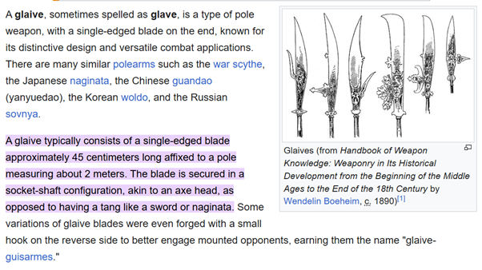

### [阿里曼：术士 Ahriman: Sorcerer](AhrimanSorcererIndex.md)

<!-- part 1，https://www.bilibili.com/read/cv44726288 -->

<h4> 第八章 心灵空间 </h4>

        “任何人不得入内。”随着通向房间的大门打开，阿里曼转过身，看向卡丁。门锁机关那嘶嘶的气声与沉闷碰撞的咣啷声回荡在空荡的走廊里，响亮得刺耳。他的身后，玛罗斯背靠走廊壁蹲伏着，犬盔左右摆动，仿佛在倾听着什么不存于此的声音。赛拉博们已经清空了方圆一公里内、任何方向上的所有舱层。

        门后的舱室并不是卡丁所预期的模样。深埋西考拉克斯号机械甲板之间，那舱室或许曾是处弹药库、又或是储存易挥发物质的仓库。它很小，只有一扇防爆门可以进入，墙壁是一块块的塑钢板。干涸的锈迹布满了这舱室的边边角角。唯一的照明来自于天花板上一只黄铜笼中、一盏昏黄的灯。这地方给人的感觉，就仿佛它曾一次又一次落于不同的用途，直到它被彻底遗忘。

        一只黑石的棺
<a href="#AhrimanSorcerer-8-1">[1]</a>
坐落在房间中央。它的上部表面雕作了模模糊糊似是人形的模样。卡丁隐隐约约能看出一张沉静的面容、还有交叠着抱于胸前的双臂的轮廓。许多的符记遍处奔流在石棺表面，刻入石中。就在他看着它们的时候，卡丁听到有声音在他意识的边缘低语。他看得懂那些符号，可却不确定是如何看懂的；它们是对亚空间的指令，令躺卧其内的人保持安静。

        “那就是她么？”他问，“爱奥贝尔？”

        “盲者的公主。”玛罗斯在身后的走廊里咝咝说道。

        阿里曼点了点头，没有离开门口，目光扫视着舱室。他穿戴好了铠甲，却并未着盔。石棺前的空地以灼进金属的线条刻印着纹迹。那些线条与螺线令卡丁看向它们时不由得眨起眼来。

        “为什么不干脆把它从她心灵里拽出来呢？倘若她有你想要的东西，为什么不就直接拿走？”

        阿里曼的目光飞速扫射着地板上的纹样，而后落在那石棺上。卡丁觉得他听到了阿里曼喃喃低语的声音，即使那术士的双唇不曾动过。

        “理解。”终于，阿里曼开口说道，依然没有看向卡丁，“没有语境的知识毫无用处。事实本身并不足够。我必须得掌握所有的、赋予那些事实以意义的一切。此外，谁知道她心灵里又可能会有些什么呢？”卡丁看见，有什么大约是一缕阴郁微笑的表情自那术士的面容上闪过，而后消散不见。“而获取这一切，需要些… 精密的技巧。”

        阿里曼呼出了漫长的、小心控制得平缓的一息，暂暂地闭上了眼。卡丁感到空气变得冰冷。他机械的肢体随着活塞与伺服痉挛起来，微微抽搐。玛罗斯自阴影里发出了一阵低沉的抽咽。

        “任何人不得入内。”阿里曼重复道，出言时唇间呼出的气息泛着白色的霜雾，“我身处此地期间，萨纳赫特与伊格尼斯拥有对舰队的掌控权。”卡丁点了点头，解下了钳在背后的双手链锯剑。他机械的手指屈曲起来，抵住了磨损的剑柄。

        阿里曼踏过了门。

        “你觉得会有人来试图干预？”卡丁问。阿里曼耸了耸肩，露出一副卡丁知道一定是皱起了眉的表情，面容阴沉下来。

        “我不确定。”阿里曼说。他向着灼入地面的图案中央走去。卡丁觉得自己看到了那些线条与符记，随着阿里曼的脚步，向外弯曲着退避开来。“或许罢。”

        “他看见一切，却又什么也看不见。”玛罗斯嘎嘎地嘶声笑着。

        “你不信任他们。”卡丁说道。那是一句平淡的陈述。“你的兄弟们，你不信任他们。”

        “我信任**你**身为你所身为的
<a href="#AhrimanSorcerer-8-2">[2]</a>
。”

        “而那又是什么呢？”

        阿里曼什么也没有说，只是望着甲板，微微调整着姿态，目光扫过那些自他所在之处盘旋发散的线条。

        “那他呢？”卡丁向着玛罗斯扬了扬脖子。阿里曼抬眼瞥去，目光落定在那残破而盲眼的术士身上。如今，不论卡丁去到那里，玛罗斯都如影随形跟随着他，好似卡丁的第二条影子。当阿里曼将卡丁召唤至他身侧，玛罗斯也来了，在他破败的铠甲里咝咝着、喃喃着。阿里曼没有反对，甚至没有对那残破术士的存在置下一词。就仿佛阿里曼甚至根本没有看见玛罗斯似的。

        “他什么也不是。”阿里曼说道。

        “那就是阿斯特罗斯死时知道的么？”卡丁说，他的声音死一样平淡。

        阿里曼的目光猛然转了过来，对上了他的眼睛。卡丁能够感觉到阿里曼心灵的手指沉在他的思绪里，试图拨开他灵魂那纠缠成团的网，寻找着愤怒与背叛的痕迹。他几乎要微笑起来。当他听闻他兄弟逝去的消息时，曾经有过那么一丝丝最微淡的悲憾闪过，可然后，那事实便只是成了诸多事实中的一桩，死寂冰冷一如篝火的残烬。他曾想过那缺乏的感受回应到底意味着什么，可却得不出任何结论
<a href="#AhrimanSorcerer-8-3">[3]</a>
。

        “我很抱歉，卡丁。“片刻的沉默后，阿里曼说。

        卡丁没有费心点头，只是转过身，面朝着走廊。他将链锯剑的剑尖栖在双脚之间，以双手握住了剑柄。他的身后，那大门伴着一丝活塞的咝咝气声封上了。

        “安静啊。”玛罗斯向着自己低语。卡丁没有回答。

  

        阿里曼望着那石棺，望了无比漫长的一瞬。他感觉到亚空间等待着，等待在他周围，它的潮汐被刻入地板的纹路塑出了形状。在他心灵的眼里，一方方金色的光之平面自那纹样中升起。一枚枚符文悬在空中，好似一只只小小的、意义与潜能的太阳，一些静着，另一些一簇簇围绕着彼此环行。罗网的中央，躺卧着那只石棺，沉眠其中一梦不醒的心灵荧荧着梦境的微光。他花费了数日来将这仪式构建。它的每一部分都好似一只庞大而精巧的，思绪、象徵、与以太力量的机器。它只在等待着他，等待他的心灵将它推动开启
<a href="#AhrimanSorcerer-8-4">[4]</a>
。

        他深吸一口气，感受着空气中的每一粒分子缓缓旋转着进入肺腑。他感觉到自己一双心脏的节律渐渐缓慢下去，直到他的意识悬滞在两拍心跳之间。一切都静住了，静止在他一眨也不眨的心灵之眼前。他等待着，漂浮在虚空之中。他凝出一念思绪，将它送了出去、在他心灵中旋转穿行。他凝出一串思绪的丝线，感到它们汲取着记忆与想象的养分、渐渐生苏。他分劈开自己的意志，一念一念分拆开来，直至他的脑海为旋舞的意识所充斥。亚空间拉扯着他的意志，试图将那精致而脆弱的建构拉扯开来。缓缓地，小心翼翼地，他允许自己的一颗心脏跳动了一下。他的心念不复身处颅骨之中；它正漂浮着，自由自在，无拘无束。镌在舱室中的仪式符文迎上了他的心灵，汇在了一起。他的意识漫漫流淌着，流淌进了棺匣，流淌进了爱奥贝尔的心灵之中。

  

        “这就是他要你做的？”伊格尼斯说。萨纳赫特维持着自己目光的坚定。伊格尼斯正注视着他呢，那面容漠无表情的。

        熔炉室端坐在赫尔墨斯之言号的心脏之地。一口生铁的碗，大得足以吞下一台战斗泰坦。一球熔融的金属在这熔炉中央的半空中旋转，蒸腾着炽意与暗红的光。没有门，只有熔炉的锅缘，位在那弯曲的铁壁数十米之上。碗中纵横着深深的沟槽，一道道直线与一圆圆剜在墙壁中的凹陷交错。萨纳赫特认出了一些几何图形，它们大约构出了索斯梅斯符记
(the sign of Thothmes)
<a href="#AhrimanSorcerer-8-5">[5]</a>
、伊德里斯序列
(the Idris Progression)
<a href="#AhrimanSorcerer-8-6">[6]</a>
, 又或是腐尸符文
(the Sigil of the Carrion)
，可每一种都仿佛模糊着，与其他他辨认不出的纹样融混在一起。整个架构都紧紧压迫在萨纳赫特的心灵上，好似一只金属的钳爪。他不喜欢这样，可毁灭团社的行事之道向来都古怪。

        伊格尼斯等待了漫长的一拍心跳，而后耸了耸肩，“当他要你背叛马格努斯的时候，他就是这样问的么？”

        “不。”萨纳赫特谨慎说道，“他从不曾将之称为欺叛
<a href="#AhrimanSorcerer-8-7">[7]</a>
。”

        伊格尼斯微微歪了歪头，可并没有移开目光，也没有眨眼。他面容上电子刺青的几何图样收缩、扩展，又乘嵌叠增起来。

        *他还没有否定我，* 萨纳赫特想着，*也还没有试图杀死我。* 他感到有希望涌上心头、拉扯着他，又奋力将它压抑下去。他无法从伊格尼斯那张漠无表情的脸上读出任何东西，也知道，即使他能窥入伊格尼斯的思绪，能看见的也只有数字与符号，在精细复杂的思维运算中飞速运转，宛如一台庞大机器的齿轮。*或许，他只是在等待他的计算得出一个行动之前的明确结论。* 毁灭团社有着许多的面相，可仓促从来都不是它的缺瑕之一。

        “你答应加入阿里曼，成为他密谋团的一员。”伊格尼斯又顿了顿，向着另一侧歪了歪脑袋，“为什么？”

        然后，那一刻，萨纳赫特又一次看见了：巫师之星的尘埃，还有那些蹒跚的身影，血肉与铠甲已无法分辨开来。他看见一团团鲜黄的眼，盲不视物的，在他曾经唤作朋友之人的面孔上眨动。他垂下眼，望向自己的手，又一次以彼时的样子看见了它，一只活生生的金属、与水晶的鳞片所构成的东西。迟迟然地，他合拢起自己的手指，一根接一根地。

        “那时候，我们正在死去，伊格尼斯。那一点上，阿里曼没有错。”

        “可是，他做下他所作下的，是错了的吧？”伊格尼斯顿了顿，缓缓眨了下眼，“是吧？”

        “嗯。”萨纳赫特说着，很悲伤地微笑了一小下，“他以为我们值得拯救，错了。”

        “所以，你将我们应得的毁灭奉予于我们？那不正是阿蒙所相信的么。”

        萨纳赫特摇了摇头。一如秘环的其他人，此前，他选择了回应阿蒙、侍奉他。伊格尼斯则不曾是阿蒙的尘埃兄弟会的一员，一如他也不曾是那施铸下红字法术的密谋团的一员一样。

        “它随着阿里曼结束了。我并不寻求将我们的军团重造，又或者给我们所有人带来救赎。”他顿住了，想起了阿蒙；在许多的意义上，他都是对的；而在另一些方面上，他则是阿里曼的镜中倒影，只是，是一面有着不同焦点的镜子。“我知道自己的极限。”终于，萨纳赫特说道。

        “那么，阿里曼呢？”伊格尼斯问。他的声音端得水平，可黑色的电子刺青在他双眼上方抽动着。

        “他相信能有个办法拯救我们所有人。再多一点理解，再完善一点知识，他就能更正他的错误。在他的眼里，有一束光在远方的地平线上舞蹈，而他如今已经作下的，不过是他为了向那终点能再迈进一步所支付代价的开端。他会将我们所有人同他一起拖下水。并没有救赎在等待我们啊 – 有的只是命定天谴的黑暗，围合在我们周旁、将我们笼罩，直到我们再也看不见我们出发的起点。”

        那样长久的一瞬里，伊格尼斯没有动、也没有说话。他面容上的纹样那样的静。萨纳赫特注视着他，等待着。远方机械的沉闷咣啷声、还有高处某一通风口的嘶嘶气声，涓滴流淌进了这寂静。

        “你又想怎么做到呢？”良久，伊格尼斯终于开口，表情一如既往的漠然，无可辨读，“你是要我向西考拉克斯号开火么？你是希望挣开他意志对红字们的控制么？你是想要试图说服整个秘环直面他、同他作对么？”伊格尼斯再次眨了眨眼，在萨纳赫特来得及回答之前，便继续径自说了下去，“所有这些方法都会失败的。其他人不会加入你。西考拉克斯号足可以直面一半的舰队而幸存下来。而他…”伊格尼斯顿住了，而萨纳赫特看到有什么东西在他黑色的双眼中闪烁跳荡，“他有着我不曾见过的力量。甚至比从前更为强大。”

        萨纳赫特摇了摇头。

        “其他人都会反对我的。阿里曼已经得取了他们所有人信服。他们正开始再一次相信他，开始有所希望，一如他们曾经的那样。我孤身一人，至少现下如此。”

        “所以，你又打算做什么呢？”

        *他依然还没有拒绝，* 萨纳赫特想着，*可如果这事情没法如我希望那样收场，那我就只好不得不杀了他了。* 他毫不怀疑自己能够做到这一点 – 他的力量已然孱弱，可伊格尼斯的力量是以其他的方式发力的，而即便如此，一柄锋刃也足以如一念思绪般轻易将他封口。

        “我要等到他再无力量、而我有他不曾意料到的力量的时候。”

        “你知道会有这样一个时刻到来？”

        “总会有这样一个时刻的。”

        伊格尼斯微微颔首，仿佛在表示着某种知晓的承认。

        “为什么来找我呢？我们可不是… **朋友**，萨纳赫特，我们从来都不是。”

        “失败。”萨纳赫特说着，令那词语随着他的呼吸，萦在空中回荡，“那便是你如何称呼伏哈尔的。我们失去了三位兄弟，而你说，那是失败。”

        “是一则计算。倘若我们如此而行、是为了将我们重造，那么将我们为这目标献为牺牲，本身便消解了胜利的逻辑。”

        萨纳赫特点了点头，露出一抹疲惫的微笑。

        “所以现在计算结果如何，兄弟？你会在我这边么？”

        伊格尼斯盯着他，目光一动不动的，面容上的纹样愈发复杂。萨纳赫特只是等待着。终于，纹样落定下来，而伊格尼斯张开了口。

        “会的。”他说道。

<!-- part 2 -->

  

        爱奥贝尔听到居住区在沉闷的起爆声中爆炸在她身后。她迈了一步，嘴里正要涌出一句咒骂。冲击波击中了她。大地瞬间消失在了她脚下。她被撞得在尘埃漫布的空中翻转。她重重摔在地上，铠甲随之破裂开来，一阵剧痛宛如刀捅一般，刺穿了她的身体。

        她的双耳耳鸣不止。翻涌的灰色尘云将她包围笼罩。她使劲吸进了一口气。岩凝土的尘埃与灰烬填满了她的肺。她咳嗽起来，感到有什么尖锐的东西在她胸膛里微微移动。她能听到有变异生物在痛苦哀嚎。它们一定有一些是被爆炸波及到了；这一点，至少还算得上一种小小的安慰。

        “霍勒格！”她向着传音链接大喊。她翻了个身，爬了起来。大地在她脚下摇摆。“霍勒格？林妮萨？卡沃尔？你们谁在吗？”

        干扰失真的呼啸噪声回答了她。

        “回答我，你们这帮没用的混球儿。”她再次呼叫着，从背带上拔出了热熔枪。那枪伴着一声尖锐的哀鸣，亮了起来。细如齑粉的灰色尘埃飘落在那武器银与黑铁的外壳上，落了一层。

        “倘若你们谁听得到的话，我想我抓到最后那点‘先知’
(the Prophets)
了，不过他们的亲眷可还都到处都是呐。”她转过身，说话间向前迈了一步。她的脚步落在破碎的岩凝土上，咯吱作响。

        那生物单单一跃便从迷雾中跳了出来。她隐隐约约地看到了惨白的皮肤、还有探来的利爪。她开火了。一线能量闪现在枪口前。空气炽热得一阵尖啸。那生物爆炸开来，化作黑色的蒸汽。她啐了一口，将烧煮熟透的血迹从眼角擦去。

        要将这城市清理干净还很需要一些时间，哪怕她调来了半个星球的防御部队、还有剩下的法务官
(the Arbitrators)
。她能找到“先知”纯属幸运，偶然的机缘巧合给了她一手好牌，而她的敌人们则落尽下风。此前，她在追踪一个惯犯，那人一直在倒腾一些极度危险的异类物品。那个异端渣滓现在依然还在什么地方逍遥法外，可他的踪迹将她引来了卡索纳
(Carsona)
、引得她深入了此地的地下文化，而就在那儿，她找到了“先知”们。

        “先知”们是未受监管的非法灵能者
(rogue psykers)
。他们向卡索纳日益增长的底层阶级提供窥入未来的一瞥。某种意义上，她觉得，他们提供了希望，或说一个做出更好选择的机会，而那些绝望的人们则以钱币、人情、又或是任何什么他们拥有的东西回报。“先知”们自己只是奴隶。有其他的人牵掌着他们的锁链、收取报酬。那些隐藏背后的主人才是真正的罪犯，鲁莽而又贪婪。一个野生灵能者，哪怕是一个只能呜咽出几句含混着亚空间的预言的，也都是一颗随时只待爆炸的炸弹。而这城里有着很多的“先知”，每一个都滴答着末日的倒计时，也每一个都只求财富。

        正是这等的卑渺短见令她最为愤怒。

        不过，她找到了他们。并且哪怕这整座城市都可能不得不被付之一炬，其他的结局都可能要远远糟糕得多。唯一一个剩下的问题，便是那个大问题了 – 是谁开始了这一切？这帮收钱人与变种人家族身后的什么地方，这场异端事件一定是有个始作俑者的。如今，既然“先知”们都已处理完毕，她要找出来这一切的源头了。

        有什么东西当后背击中了她，掉在了地上。她低头看去。一碎手指大的岩凝土躺在她脚边。

        “哦哟，泰拉的王座啊。”她喃喃说道。

        她感到另一下冲击袭来，这一次更猛烈了。然后，一下又一下，而她突然抱住了头。废墟残骸的碎片自她身边呼啸着川流而过，好似被卷入了一场旋风的中心，她裂了缝的铠甲随之叮当作响。一阵尖锐的风声咆哮自迷雾中传来，回响着。随着那声音在她周围回荡，她蓦地抬起头来。一道道蠕虫似的紫红光芒正在半空里凝出形状。尘埃的云中，正有尖叫声传来。她能在心灵里尝到绝望与恐慌的味道。金属与腐烂水果的味道在齿间刺得她微微发痛。她错判了情况，并且错判得相当厉害 – 这一切都马上就要变成某种更为糟糕的东西。附近的什么地方里，另一个不受控的灵能者正在觉醒。

        一大块横梁自她身下抽打上她的双腿，而她顿时间跌倒下去。她并没有撞在地上。看不见的绳索鞭了过来、缠绕上她，将她穿过空中向上拉去。渐长的狂风中，她能嗅到丝绸燃烧的气味、听到昆虫振翅的沙沙声。许多幽灵似的声音呼唤着她，向她允诺着永恒。她坚硬起自己的意志，以当年令她在黑船上活下来的方式专注起精神。她比那风中的声音，比那些絮絮的低语，都要来得强大。那些低语正絮絮着要她屈服，要她将心灵向着这距她不过一念之遥的、可能性的风暴大敞开来。

        一根碎石的柱自迷雾中刺了出来，砸在了她身上。她听得一声骨头断碎的裂声，左腿霎时间斥满了烈火似的痛。她没有尖叫。不可见的绳索消失了。她跌在地上，翻滚着，滚过了地面。黑色的斑点绽放在她视野的边缘。她静静躺着。现在，那痛楚便是她的整个世界了，它的边缘被她意志的高墙描绘界定。尘埃与碎砾自她身边奔流飞过。

        她正身处一片居住单元的废墟里。它残破的结构柱耸立在她周围，好似断折的手指。她活动了一下左手，发觉热熔枪还握在手中。她啐了一口，看着黏稠着鲜血的浓痰打着旋儿消失在风里。那灵能者很近了。她能感觉到那存在，在她的意识里泛着滋滋的响声，好似一团弹药燃成的火。她抬头望去，看见了通向这残破居住单元地下室的入口。有碎石自那矮门中飞射而过，而她能看到有光在门后的黑暗中噼啪绽裂。

        她试图动弹，感到痛楚在她动起左腿时顺着腰侧颤射上来。她闭上眼，找到了那些在她心灵里拉扯的、痛楚的丝线。那些丝线鲜红，锯齿似的尖锐。她开始将它们拆解开来、编入一团，放进一方独立于她的空间里，一处她可以将它们忽略不见的地方。那并不是某种灵能的能力，只是训练与意志结出的果。

        几乎花了足足一分钟，她才得以再度站起。她的断骨在她一瘸一拐走向通往地下室的门时，在她的肌肉中碰撞碾磨。

        有更多的变种人在这里，可大多数都已经垂死抑或死去。岩凝土与金属的尖锐碎片，枪弹似的，将他们中的大多数射得千疮百孔。那些尚还活着的，在她经过他们身旁的时候，沙哑地啼着。有羽管自他们的皮肤下萌出，乳白的眼遍处睁开在他们的血肉上。破败褴褛的罩袍垂挂在他们身上，好似蛇类半褪的皮。

        地下室里一片寂静。上方，以太的狂风呼吼咆哮，整座城都在自行撕扯着、分崩离析。而在这儿，一切都那样的静。一个男人坐在这空间的中央。有残骸聚集在他周围，小片缓缓漂逐的焦黑纸屑与灰烬，堆了过来、在地上形成了一道覆满地面的螺旋。幽蓝的火焰萦附在天花板上，在岩凝土间无声翻滚，无声也无烟。随着爱奥贝尔走了进来，那男人抬头望来。他并不年老，可爱奥贝尔看得出，辛劳已经窃走了他最好的年岁。他脸上的血肉在劳役码
(labour-glyph)
的棋格图样下松垮垂着。遍布血丝的双眼迎望上爱奥贝尔的眼，瞳孔收缩成了细小的点。有什么东西在他的皮肤下动了动，涟漪一样。

        “怎么…”他嘶哑喘息着，下巴空嚼着，“我该怎么办啊？”爱奥贝尔走近了一步。“我不知道该怎么办了。”那男人颤栗着。他正在哭泣啊，她看见了。“我只是想要停下来。求求了。这是一场梦么？我想这也许就是场梦呢。我只是想要它停下来。”现在，那男人浑身在剧烈颤抖着。他的脸颊红亮着，上面满是泪水。爱奥贝尔的手指绷紧在热熔枪的扳机上。那柄枪伴着一声低声呜咽，上好了膛。

        那男人忽然猛地抬起了头，皮肤一阵涟漪似的抖动。“普罗斯佩罗的孩子们。”他说，而那声音是一阵空洞的嘶哑喘息，“我看见普罗斯佩罗的城，而今倾伐如草被割下。它的孩子们呼唤着我。我们是他们的孩子，一如他们是它的孩子。我们即是他们的复仇。”最后的言语在这地下室里回荡，隆隆的，愈发地响亮。尘埃与碎石自地上升扬而起。他的脸鼓胀起来。爱奥贝尔有种隐约的感觉，仿佛看到有手指压迫在那绷紧的皮肤上。

        她扣动了热熔枪的扳机。一道灼热的光线当胸击中了那男人的胸口中央。他躯体的脂肪与血肉汽化了那么一瞬，而后他扭曲得不成样子的骨骼爆炸开来。一声群鸟啁啾似的嘈杂尖啸划破了空气，愈发地尖锐高亢，好似一群腐尸之鸟的声音
<a href="#AhrimanSorcerer-8-8">[8]</a>
。天花板上蓝色的火焰猛地一涨，火苗探展如伸出的手。然后，它消失了，将爱奥贝尔留在了半明的晦暗里。一秒钟后，废墟残骸开始噼里啪啦砸在外面的地上。那声音听上去仿佛冰雹落下。

        爱奥贝尔呼出一口气来，而后瘫倒在地。

        *普罗斯佩罗。* 那个词在她思绪里喃喃低语，与此同时，一阵头痛在她脑子里尖声大叫。那意味着什么呢？她曾听过疯子与煽动家那冗长而激情的胡言乱语，曾自成千上万的异端那里探得过真相。而经历了那一切的时日，她早已学到，他们的言语里鲜少有真正的真相，哪怕真有，也最好将之忘记。可那死去灵能者的最后话语响彻在她思绪里不停回荡，好似一声困在回音室里的声响。*普罗斯佩罗的孩子们…*

        “所以，就是这样开始的啊。”一个声音自黑暗中传来。她扭过身，举起了热熔枪的枪口。黑暗在她开枪的那一刻，刹时间亮成了白昼。那里什么也没有。只有支撑着柱子的岩凝土，还有一瞬而逝的、扭曲失真的影子。在她躺倒的地方，她扭动着身体，再次探展出自己的心灵，嗅闻着亚空间，感受着它受创伤损的血肉，就仿佛它是她自己的肌肤。她停住了。

        它已经不在那儿了。亚空间消失了。她心灵中，诸感官的皮肤之外，只是一片虚空。

        “这并不是真的。至少，不是大部分人理解里的那种真实。”那声音温润，沉稳含蓄，“我还以为你会需要再久一点才能意识到呢。”

        一个男人自一根断柱后踏了出来。她的手指绷紧在了扳机上，却没有开火。坚实而线条流畅的肌肉流淌在他赤裸的胸膛与肩膀上。金与银的饰环在他光裸的头皮上闪烁着晦暗的微光。一双巨大的手舒张着，松松垂在一双入鞘长柄刀
<a href="#AhrimanSorcerer-8-9">[9]</a>
的刀柄旁。那男人半张脸看起来仿佛打了结的皮革，伤疤纵横交叠，叠成了纠缠交错的龙与蛇。他以另外的半边脸向她笑了笑。在那男人勾起的嘴角，磨得尖锐的齿尖露了出来。

        是霍勒格，她的仆侍兼保镖。或者，至少看起来同他一模一样。可霍勒格没有舌头，也无法说话。“我还以为需要我们更多点时间才能到达这儿呢。”那个不是霍勒格的男人说道。

        爱奥贝尔使劲扣下了热熔枪的扳机。什么也没有发生。她又扣动了一次，依然无事发生。她感到一阵战栗袭过全身。那个不是霍勒格的男人踏上前来，走得更近了。那男人有着蓝色的眼，明亮苍蓝的眼，那颜色好似日光下的大海。她试图站起身，可她腿中的痛楚忽然加剧起来。她能感觉到断骨刺入血肉的剧痛。她倒抽了一口凉气。

        “就像我说的，这并不是真的。”那男人在她对面蹲了下来，臀腿的肌肉绷紧得坚实，“不过，是有些办法，可以令它感觉起来同真实无异。”

        “恶魔。”她嘶嘶地低声说道，可哪怕就在她说着的时候，她也并不确定。这感觉并不一样，感觉仿佛是什么已经发生过的事情。

        “不。并且，除了你，唯有我是真实的。”

        她突然觉得那样寒冷。

        “你叫什么名字？”她小心翼翼开口。

        “好问题 – 名字是有着力量的，不是么？你想要看看我是否会回答，而如果我回答了、又答了真话，那么，你便开始有了可以杀出一条路来的武器。”他又一次微笑起霍勒格那扭曲的笑容来，“那便是你在打算着的，不是么？机智，永不屈服，一直都在寻找着通向胜利的路、哪怕一切都模棱未定 – 你是个很了不起的人呢，瑟兰德拉·爱奥贝尔。你有一颗很强大的心灵，比我本以为尚还身为凡朽之人所能够的，来得更为强大。”

        “你的名字是？”她在喉中低吼，拼命将痛楚压制下去，关抑住心里的惊惶与疑问。这是某种把戏，那些生衍亚空间中的恶魔更为伟大的幻象之一。它或许并非真实，可那并不意味着她要屈服于它的谎言。

        那男人只是再次微笑起来，摇了摇头。穿在霍勒格眉间那一排纯银的饰环摇晃着，响成一片琐碎的叮当。

        “我的名，是阿泽克·阿里曼。”他说。她如遭凝冻般僵住了，胳膊上寒毛直竖，刺刺地痛，好似被一阵冰冷的寒风触碰。她的舌头僵滞在了嘴里。她的目光定在那男人双眼两点明亮的蓝上，忽然间意识到自己并不是那个清洗了卡索纳“先知”们的审判官爱奥贝尔了，或者，至少，不再是了。卡索纳已经是一个半世纪以前的旧事。彼时，她尚还不知普罗斯佩罗的名，尚不曾听闻它生诞的军团，也不曾知闻“阿泽克·阿里曼”这名字。他是对的，这便是一切开始的地方。这一刻，在一片残破居住区的地下室里的那一刻，便是她自无知走向启明的旅途的开端：那场将会通向阿波罗尼亚的旅途…

        她将那尚在成型的念头关抑下去，奋力将它自意识之中抛逐开来，深深埋在心底。那就是他在追寻的东西，他前来找她的缘由，他为何披挂着一位忠诚朋友的面容、站在她过往的废墟里的原因。

        阿里曼点了点头，站起身来。

        “这段记忆位于你心灵浅表的附近。在此之前，你最后记得的，本该是那场密会、还有对我副官的审讯。你的心思本应是全落在我、还有我的意图之上的，可是，这一段记忆却成了你脑海中浮现的第一段回忆。为什么呢？”阿里曼望着她。他凝然的目光落定在她身上，好似实体的一记重击，“因为这便是将你带来我面前那条路途的开端。”

        爱奥贝尔忽然间感到仿佛有一碎冰冷的铁滑入了她的胸膛。她的思绪飞速回溯着阿里曼刚刚的话语，回溯着看起来发生在眼前的一切。这一切正发生在她的心灵之中，她的记忆之中。有一个什么原因，令她身于此地，身于这特定的一段记忆里。这并不是一场审讯，而是一场对她记忆的侵入，一眼钻入她心灵外层的洞。她闭上了嘴，收回思绪，将意志化得坚硬。

        阿波罗尼亚，他来了，为了阿波罗尼亚而来…

        她强迫着那念头沉进了更深处，埋葬心底，将一层层饱经训练的意志紧紧钳裹其上。麻木感蔓延过她的一块块意识，她的一段段过往在刹那间死去冰冷。那些她曾携负铭记了许多个十年的名字与事实消逝不见，吞没在她心底深处。

        那不会够的，她想着，哪怕就在意志的高墙增长立起、记忆的壁障凝成在她心灵里的时候。面对他那样的存在，不会够的。唯有逃离或死亡能够将那秘密保守于他。我必须得找到个逃离的办法，或者，一个死去的办法。

        “你大可以隐匿我要寻找的，审判官，可我终会找到的。”

        她张开嘴，想要说话，却发不出声音。居住区地下室的影像正在分崩离析，鲜血一般流泣进黑暗里，好似打湿的颜料自画布上流淌滴落。唯有那双苍蓝的眼依然凝视着她，刺透了她，那眼里闪烁着璀璨的碎光，光辉如残酷的寒星。

        “够吗？他能听见我们吗？”

        那声音自他上方传来。还有光，或许是阳光，穿透一片灰蒙蒙的雾，洒落下来。不过，他不确定那光距离他有多遥远。那声音听上去隐约的熟悉，可他也不确定他之前是在哪里听过这声音。

        “高度的正常认知与感官意识概率。”第二个声音是一阵机械敲击的咔啦，“阿斯塔特生理机能产生了系数不定的—”

        “他听得见我们。”第一个声音插了进来。他听得那说话者舔了舔嘴唇，“你听得见，不是么？”

        他没有回答。不，事实上，他不知该如何回答。他能发出那些如同他听到那样的言语么？他只是无言地听着。他能听得低沉的咝咝声与喘息声，还有几不可闻的嗡鸣在有节律地悸动。

        激活仿生义体，他的脑海里，一个声音说道。他知道那声音是对的，却不知道为何。是的，激活仿生义体，还有… 武器… 不… 是的，可还有别的什么东西… 什么低沉的声音，好似动力铠甲的嗡鸣。然后，气味也传了过来。浓烈得厚重的、刺鼻的臭：机油，消毒剂，还有线缆盘绕在死去血肉附近运行得滚烫。有呼吸，沉重而潮湿，携着被污染的肺的气味、辛辣食物的气味、咖啡因燃焦的气味、还有 --

        “你能让他看见么？”又一个声音问道，那是个不同的声音。女性的，比此前那两个都更远些。他能听得她尖锐清晰的咬字响起在她干瘪凋零的胸膛里。他也曾听见过那声音，可记不得是在何处了。可是，他记不得真的重要么？

        雾气与烟霾朦胧的太阳消隐了。将它们取而代之的世界，是苍淡的蓝。他能看到一组人影，站在一池灯光里。那灯光之外，一切都是暗影，渐渐模糊进一片不知延展至多远的黑暗。那池灯光的中央，躺卧着什么物体。起初，他以为那是一台机器，可然后他看见了血肉静卧在那大团的管线之下。那是一具躯体，箍在了一张金属的桌上，针头为端的管线扎在它的肌肤与血肉上，它的呼吸是玻璃烧瓶间迟迟吸起的液体。它的头是一张金属的无眼假面，光晕似的环着线缆，口部是一条黑色的狭缝。两道身影站在它近旁；最近的那个没有腿，而是漂浮在地面上空约莫一米处的地方。两套闪闪发光的肢体自它长袍的阴影间垂了下来，三枚翠色的眼在兜帽下缓缓旋转着。第二个身影是个人类，有着一张瘦削冷硬的脸，穿着素朴的黑袍。更远的地方，一个身着光亮外骨骼的枯瘦老妇人站在一位有着亮闪闪晶体眼的男人身旁。三个兜帽斗篷的随从立在那晶体眼的男人身后，以粗厚的线缆连接在那男人的脊柱与颅骨上。他们全都在注视着房间中央，那束缚机械之中的身影。

        他认出了他们所有人，却不确定为何。似乎他们没有任何一个人对他忽然出现在房间的另一侧有所反应。他再一次打量着他们每一个人，试图眨眼，却没能成功。

        那漂浮着的四臂身影转了过来，看着他。它三枚透镜的眼旋转得更快了些，而后咔哒着，静了下来。

        “监测对象现在可以看到我们了。”那声音是和之前一样的同一音机械咔哒。然后，他们都转了过来，看着他。瘦削面孔的男人皱起了眉，扬起了一根扭曲畸形的手指。

        “再近点。”

        他向前漂去，漂过那埋葬在吸液管的蛇群之下的身影。就在他飘过的时候，他在众多装满液体的药剂瓶间看见了一抹倒影，映在一只瓶上，滑过那药剂瓶玻璃的表面：一只抛光的颅骨，没有下颌，一簇透镜塞满了左眼的眼窝。他继续向前动着，思绪忽然间一片混乱。那是一只伺服颅骨啊：他认出来了，感到那震惊轰然席卷了他稀薄而受限的意识。

        那瘦削男人的面孔现在与他的视线齐平了。

        “告诉我，你能说话吗？”

        不，当然了，他说不了话的。那话语以无声的挫败感在他心里回荡。他没法…

        一阵液体泛涌的咯咯声响从那桌上的身影中传了上来。

        “不… 不。”

        “很好。”瘦削面孔的男人说道，而后很勉强地笑了一下，那笑容称不上笑容的。

        然后，那一刻，他明白了，也明白了为何他正通过一只伺服颅骨向外窥看，明白了为何在他刚开始得见这房间的时候，无人将目光看向他。他便是那桌上的身影。那受创而伤损的血肉是他的。那张透过金属假面上的狭缝言语的嘴是他的。而他没有双眼。

        “你是谁？”他问。

        “我啊，”那瘦削面孔的男人小心地说道，“我无关紧要。而你呢，你才是真正要紧的焦点。”他向着悬浮空中的技术神甫瞥了一眼，“虽然我明白，你的认知能力现在受到了阻碍，但我们会帮助你将它恢复的。”他小心翼翼地点了点头，“我们会帮助你记得。”

        “记得？”

        “是的，并且，且容许我以提供你些什么开始吧。我们需要了解你更多的东西，很多很多的东西。可是，我们会需要你来为我们领路。为此，我们需要个什么起点，供你开始。你的名字。”那瘦削面容的男人顿了顿，“你的名字，是阿斯特罗斯。”

        阿斯特罗斯。那名字隆隆翻滚着涌过了他心头，好似一声穿透迷雾的大喊的回声。是的… 是的。那是… 那就是我的名。

        “我为什么会在这儿？”阿斯特罗斯问道。

        那瘦削面容的男人抱起双臂，一根瘦长的手指歇在了下巴上。

        “一个很好的问题。”他说。

（第八章 完）

 

  
 考虑到上一章还没调好格式，暂时先不链接上一章过来了吧（喂）

  
 上一章 | <a href="AhrimanSorcererIndex.html">目录</a> | 下一章 

  

**\* 机仆注：**

 1. sarcophagus. 棺材的一种，石制而雕饰华丽，大多暴露于外。
[\[^\]](#AhrimanSorcerer-8-1a)

    

 2. 原文 I trust you to be what you are. 大白话说，大概类似于“我相信你会就是你”。
[\[^\]](#AhrimanSorcerer-8-2a)

 3. 一个大概有点年头的设定。被附魔之后 (卡丁被附身的剧情参见《放逐者》11-12章) ，灵魂残缺，剩下的部分会不再足够恶魔寄宿。这种灵魂的残缺会导致情感缺失，从此所有的感情都淡淡的了。具体扯淡参见
[【文末附录】](#AhrimanSorcerer-8-Appendix)。
[\[^\]](#AhrimanSorcerer-8-3a)

 4. 原文set in motion. 即，start or trigger a process or series of events. 有一个“后面一系列的东西被推动后依靠惯性自我运行”的味道在。
[\[^\]](#AhrimanSorcerer-8-4a)

 5. the sign of Thothmes，千子用于隔绝内外信息来往的符文。初见于《千子》第三章 cv1871614，彼时小马以此符文屏蔽外界一切窥探。《放逐者》第16章 cv26244960 亦有提及，彼时阿教授以之反向隔绝外界察觉符文之内他们一行人的动静。顺便一提，这个符记是以第一任天枭圣堂讲师的名字命名的。Thothmes一名，可能是在neta古埃及神话里，白鹮头的智慧之神Thoth. 
[\[^\]](#AhrimanSorcerer-8-5a)

 6. Idris, 古兰经中的先知之一，一说亦名“以诺”Enoch -- 啊对，就是“以诺语”那个以诺。
[\[^\]](#AhrimanSorcerer-8-6a)

    Ref: https://en.wikipedia.org/wiki/Idris_(prophet)

 7. 同上文所用的betray不一样，这里用的是treachery. 叛国欺君的那种。
[\[^\]](#AhrimanSorcerer-8-7a)

 8. 原文rising like a flock of carrion. 目前暂时取的直接意译，不过另有一说认为 flock of carrion 或许是a flock of carrion birds的省略，因为已经有个flock指向鸟群了。有意思的是，虽然carrion birds字面意义指的是食腐鸟类，但网上搜索的结果大多情况下指向的是乌鸦。
[\[^\]](#AhrimanSorcerer-8-8a)

 9. glaive. 单刃而长柄的冷兵器。
[\[^\]](#AhrimanSorcerer-8-9a)

    

    
 https://en.wikipedia.org/wiki/Glaive 

  

 **【文末附录】** [\[^\]](#AhrimanSorcerer-8-3)

关于附魔与其带来的影响 -- 感谢 @fatman 对这一设定的提及！

