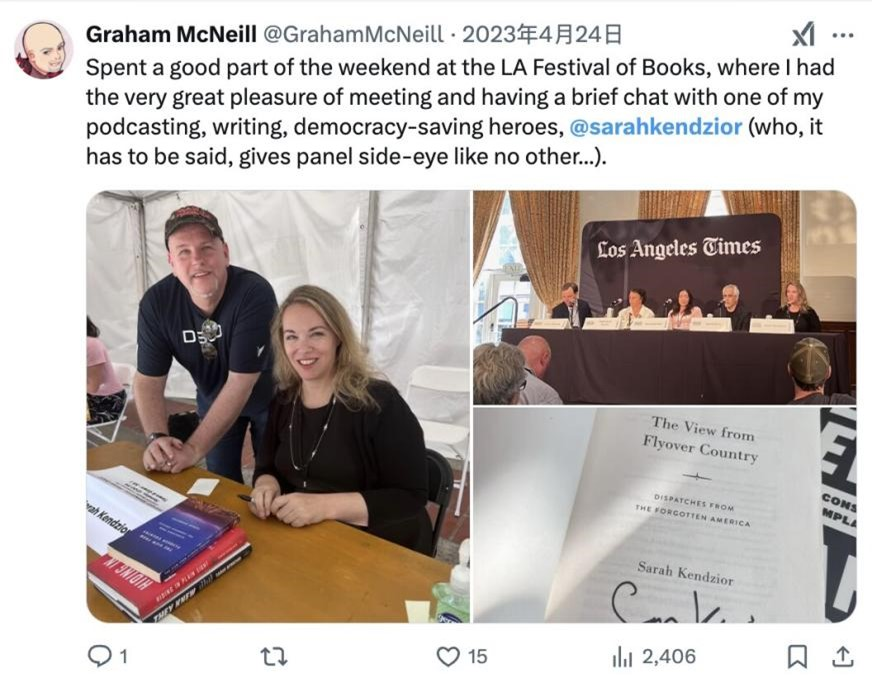
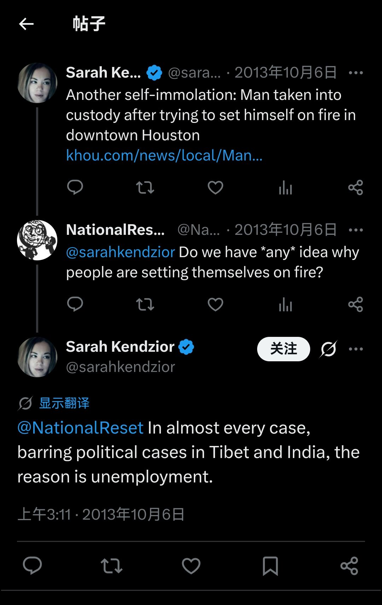
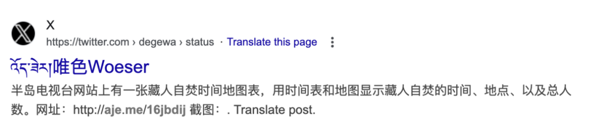

尊敬的浙江科学技术出版社总编室：

您好！

我是贵社所出版战锤系列小说的一名读者，得知贵社计划翻译并出版格雷厄姆·麦克尼尔（Graham McNeill）所撰写之小说《红魔马格努斯：普罗斯佩罗巫王》“Magnus the Red: Master of Prospero”（ISBN 13: 978 1 78496 482 5，以下简称《马格努斯》）一书后，我意识到关于本书内容可能存在一些尚未被贵社注意到的具体情况，作为贵社的忠实读者，本着负责的态度向贵社反映如下：

该书的内容中存在部分对我国的影射，疑似包含极端刻板印象与涉华政治问题的抹黑，结合小说英文版内容与作者在社交平台公开发布的言论，该书的翻译引进可能存在一定政治风险。

 

一、 《马格努斯》一书中对我国的影射

（一）有关中国的描写

在《马格努斯》中，存在一处情节：主角一行在黎明星出土的飞行器上发现了中国国家航天局的标志。单看这一情节，似乎可以认为这一设计属于彩蛋性质，且作为时间设定在遥远未来的太空歌剧故事，出现旧时代地球造物本不足为奇。

然而，作者在后文中的描写显示，这一设计并不单纯作为“彩蛋”存在，而是存在一定政治影射成分：

【“Yes. When the eastern ethnarchs fell, the Thousand Sons marched across the cindered remains of the Dragon Nations, preserving and learning all we could of that land's ancient history and culture. Much had already been lost in the fires of self-immolation, but in the ruins of Ba-Shu, we found the remains of a storage facility for rockets intended to bear atomic warheads. However, that did not appear to be its original designation -its true purpose was a launch station for trans-orbital craft, perhaps the first to breach the solar system. Some of the walls had a faded versions of this symbol painted on them.”

试译：“是啊。当东方的那些族国（ethnarchs）陷落时，千子们一路开拨过神龙国度（the Dragon Nations）那灰烬的废墟，尽我们一切所能地去保存、去了解关于那片土地古老历史文化的一切。大部分都已经失落在自焚（self-immolation）\*1 的大火里了，可是，在巴蜀（Ba-Shu）的废墟里，我们找到了一座导弹储存设施的遗存，其中的导弹本计划要用于携带核弹头的。然而，那似乎并不是它原本被定于的用途-它真正的目的，是一座发射站，用于发射跨轨道飞行器的-或许是第一个突破太阳系的飞行器呢。那里的一些墙壁上，有这符号褪淡的版本涂画其上\*2。”】

1. Self-immolation-这个词有着非常强的指向性，指的是通过宗教化自杀的方式表达抗议。

2. 影射我国四川的西昌发射基地，并且进一步间接印证了前文 “出土文物上的徽记、既一说黎明星最初的徽记乃是我国国家航天局的标志” 一说。

 

（二）疑似有关涉敏感政治问题的情节

在《马格努斯》一书中，另存如下一段情节：主角一行前去寻找失联的行星领导人。然而，在找到幸存的普通民众和领导人后，前来的当地部队 -- 以圆圈中的五角金星为徽记、以“红龙”为部队名称 -- 对幸存的民众展开了屠杀。

【An avalanche of rubble cascaded into the street as its enormous mass cleared a path for the smaller vehicles behind it - a mix of Rhinos, Chimeras and Executioners. All were painted in the colours of the Red Dragons, and Magnus nodded to himself. At least the survivors gathered around him had a means of escape now.

The Baneblade slewed to a halt, and the cupola on its topside opened. A soldier in the tough canvas and leather of a tanker’s tunic emerged, his face obscured by a visored helmet and rebreather apparatus. A golden pin depicting the encircled star that was this planet’s sigil glittered at his lapel.

……

The soldier touched his hand to the side of his helmet and nodded at whatever order he was being given. He dropped back inside the Baneblade and slammed the hatch shut behind him.

Seconds later, the vehicles opened fire.

……

He dropped Konrad Vargha as the supplicants surrounding him scattered in screaming panic. High-calibre *shells* from sponson-mounted assault weapons raked them, cutting *down* a score of people almost immediately and wounding *dozens more*.

The Red Dragons were slaughtering their own *people*.

试译：随着那坦克的庞然身躯为其身后更小型的车辆 – “犀牛”运兵车、“奇美拉”步战车、与“处刑者”坦克 \*1 的混合 – 清出一条道来，一堆碎石雪崩般倾泻而下，冲上了街道。所有的车辆都涂装着红龙部队 \*2 的色彩，而马格努斯自顾自点了点头。至少，聚集在他周围的幸存者们，现在有个逃生的途径了。

那辆毒刃坦克猛地停了下来，顶部的穹顶舱盖打开了。一位身着粗帆布与皮革的坦克手军服的士兵从中现了出来，他的面容遮隐在有着护面的头盔、还有循环呼吸装置之下。一枚金色的领章，上绘着“一颗被环绕的星”这一该星球的行星徽记，在他的翻领上闪闪发光。

……

那士兵举手轻触了一下头盔侧檐，向着他被给予的、不管是什么的命令点了点头。他缩回毒刃坦克里，猛地关上了身后的舱门。

几秒钟后，那些载具开火了。

……

他（注：指马格努斯）丢下康拉德·瓦尔加（注：行星领导人），周围的求救者们惊恐尖叫着，四散奔逃。侧炮架上的突击炮发射的大口径*炮弹*扫射而来，几乎瞬间就*炸死了*二十多人，并导致*数十人*受伤。

红龙部队正在屠杀他们自己的*人民*啊。】

1. 均为本世界观下的军用车辆型号。后文“毒刃”坦克亦然。

2. The Red Dragons，当地行星防御部队（政府武装力量）的名称。

考虑到上一节中提到的、本书中黎明星对我国的政治隐射，该段“名为红龙的政府部队在广场废墟上屠戮人民”的情节，与某些境外媒体抹黑我国、捏造事实的论调极其相似。

此外，这也不是本书中唯一一处“政府迫害、屠戮人民”的情节。在本书更后期的情节主线里，作者耗费数章笔墨，交代了这颗行星的历史来源：黎明星起源于一艘自神龙国度启航的殖民船。路程当中，亚空间风暴袭来，而船上的执政者为存活，伙同民众将船上所有的灵能者关押起来，活生生抽吸灵能、迫害致死。这些死者的怨念凝成了怨灵“夏坦 (Shai-tan)”，进而导致了本书的主线剧情——黎明星的毁灭。考虑到本书里黎明星对我国的映射，该部分剧情桥段疑似有故意设计，刻意与外媒有关我国“迫害人民”虚假指控相对应之嫌。

 

（三）疑似有关涉藏问题的用词

在《马格努斯》一书中，曾两次出现“Mount Kailash”一词：

【His name was Felix Tephra and he was the elected spokesman for this horticultural collective on the fertile slopes of Mount Kailash.】

【He held out the slate upon which the Mechanicum's data indicating Mount Kailash's inevitable fate was clearly displayed. 】

然而，该词历史复杂，如今多为藏独及支持藏独的部分西方NGO组织对冈底斯山主峰（即冈仁波齐峰）的特殊称呼，与涉藏主权问题有着脱不开的联系。

更为令人忧虑的是，该词在小说中确实是有实际剧情意义指向的。小说中足花费了半章的文字，讲述当地人视Mount Kailash为圣山，并在此地即将毁灭时，宁愿随山毁灭也不肯随部队离开。这一情节，同部分西方媒体伙同藏独势力炮制的“藏民自焚”抹黑叙事是十分相似的。这一类叙事于约08-15年期间格外甚嚣尘上，而无独有偶地是，本书恰好成书于约13-15年，并于16年出版。

本书中存在多处涉及中国的影射，且影射方式与内在隐喻与部分反华媒体宣传方式不谋而合。结合作者本人社交媒体动向来看，这并非一个巧合。

 
 

二、作者本人与反华媒体人士的往来

  
  
图：作者在推特上与所谓“民运分子”往来密切

 

  
  
  
  
图：该民运分子在社交平台的部分涉华言论节选

 

  
  
图：麦克尼尔就此人涉华书籍与之互动

 

如图所示，该民运分子在某社交网站存在大量有关我国涉藏问题的反动言论，且至少自2013年起，就为某些境外媒体对我国进行政治抹黑、煽动涉藏问题提供所谓“资料支持”。格雷厄姆·麦克尼尔与其交际并非私人层面、非政治性的，而是明确存在为其站台的行为，并曾在公开社交媒体平台对其作品的支持。

结合前文影射桥段，有理由怀疑作者曾通过某些“人权分子”接触了反华内容及藏独宣传资料，并在写作过程中，有意或无意地将相关材料用在了故事构建当中。

作为科幻小说，出现中国元素本身并不是一个问题；然而，当作者本身的认知就已经被某些宣传所“毒害”，其政治倾向也就容易夹杂在作品中，成为流向读者的“毒草”。作为面向大众读者的娱乐读物，其中的政治风险不可不考虑。

恳请贵社核实上述问题，并在引进该书时予以考量。谢谢！
