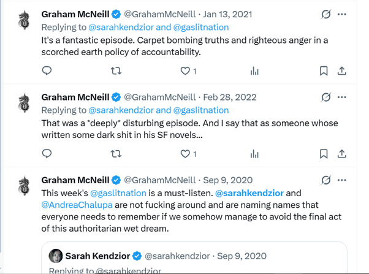
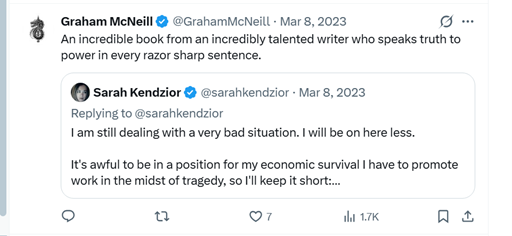
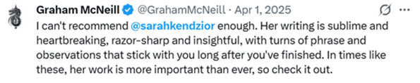
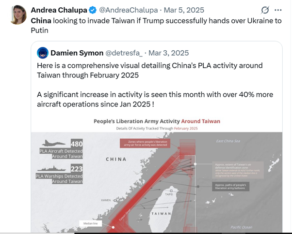
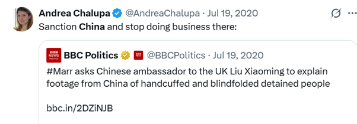
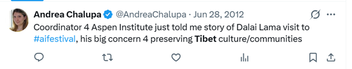
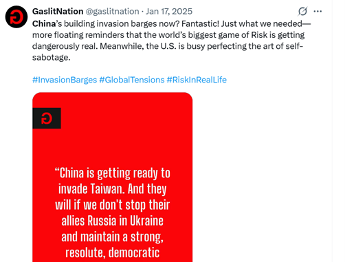
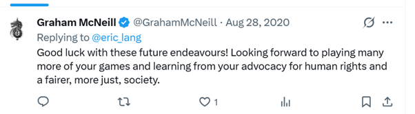
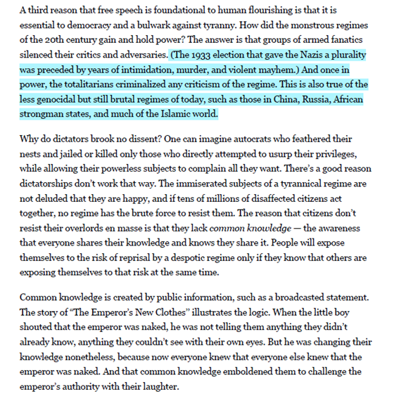

[续上](Declaration.md)，将后续与浙科社邮件往来附录如下：

---

尊敬的读者：

您好！感谢您的来信！您在邮件中提到的关于我社计划出版的《红魔马格努斯：普罗斯佩罗巫王》一书的相关情况我们已经收到，非常感谢您对我社出版项目的关注，也感谢您及时指出该书可能存在的意识形态方面的问题。

对于引进版的科幻类出版物，我社在出版前都会进行印前审读，由浙江省新闻出版局邀请意识形态方面的出版专家对文稿进行审读并根据他们的意见对文中出现的意识形态问题进行修改，修改后才能予以正式出版，您附件中的相关内容我社也会仔细阅读并转交审读专家及责任编辑，请您放心。

至于你提到的作者有不当言论的事情我们也会及时调查跟进，并及时向浙江省新闻出版局汇报，最终确定是否出版。

最后，再次向您致以诚挚的谢意！此致

敬礼！

 

  浙江科学技术出版社总编办

 

---

 

尊敬的浙江科学技术出版社总编室、尊敬的吕老师：

    您好！万分感谢贵社在百忙之中抽出时间对读者来信进行回复。应贵社所需，将目前所收集到的部分关于格雷厄姆·麦克尼尔的社交媒体情况截图补充于此，请参见附件。时间精力所限，不免或许有所遗漏，若贵社还有任何需要的信息，请不吝联系，我们愿意尽一切所能协助。

    十分感谢贵社在战锤小说引进出版上所作出的一切努力。祝愿贵社的出版引进工作越做越好！此致

敬礼！

 

<h3>
  关于格雷厄姆·麦克尼尔社交媒体情况的简述
</h3>

 

目前能够确定的是，格雷厄姆·麦克尼尔 (Graham McNeill) 本人长期来往并支持的自媒体及媒体从业者中，不止一位有反华倾向；且麦克尼尔本人为其中部分人直接站台背书过。此外，麦克尼尔本人亦曾对某些反华社论进行过直接转发。现将其中部分言论截图整理如下：

 

**一、作者本人与部分反华媒体从业者的互动**

麦克尼尔本人于社交媒体上，在长达数年的时间中，与某些反华媒体、自媒体、及其从业者有所密切来往。以下为部分截图：

 

  
  
  
  
  
图：麦克尼尔在社交媒体上常年与Sarah Kendzior、Andrea Chalupa等“人权作者”往来密切、并多次为其站台背书

 

  
  
  
  
图：麦克尼尔频繁互动的媒体从业者Sarah Kendzior部分对华、对藏言论节选

 

  
  
图：麦克尼尔与上述作者就其涉华书籍的直接互动

 

  
  
  
  
图：麦克尼尔频繁互动的媒体从业者Andrea Chalupa部分涉华、对华言论节选

 

  
  
图：麦克尼尔频繁表达支持的自媒体账号@gaslitnation部分涉华言论节选

 

  
  
图：麦克尼尔于其社交媒体上时常表达对“人权”等话题的高度关注

 

 
 

**二、作者本人对反华社论的直接转发**

2015年1月26日，《马格努斯》一书正式发售前、大概率仍在创作期间的时候，麦克尼尔曾如此在社交媒体上转发：

 

  

  

此文系波士顿环球报发布的一篇社论，“为何言论自由至关重要”。原社论见于以下链接：
https://www.bostonglobe.com/opinion/2015/01/26/why-free-speech-fundamental/aaAWVYFscrhFCC4ye9FVjN/story.html。

该社论的作者, Steven Pinker, 也在其个人主页上对此进行了备份：
https://stevenpinker.com/files/pinker/files/why_free_speech_is_fundamental_-_opinion_-_the_boston_globe.pdf

这篇社论中，可想而知地，对我国所谓“言论不自由”进行了大量论断。而更为危险的，则是此文中明文将我国与纳粹相提并论、归为一类，明确指控我国疑似种族灭绝。

 

  

  
 
鉴于麦克尼尔本人常年在社交媒体上的表现，他对这样一篇社论进行了转发、且并没有进行任何批判，我们有理由怀疑麦克尼尔本人对这篇社论的内容哪怕不说支持，至少是不反对的。尤其值得忧虑的是，按照麦克尼尔本人在其《猩红君王》的作者后记中、对《马格努斯》与《猩红君王》两本书创作过程的记述，这篇社论的时间大概率出现在《马格努斯》的筹备或创作期间，因而我们格外忧虑《马格努斯》一书可能在创作过程中，受到了这类对华抹黑报道的影响，乃至写作过程中有意或无意地将相关材料用在了故事构建当中。

恳请贵社核实上述问题，并对此予以考量。期盼贵社的回复。谢谢！
