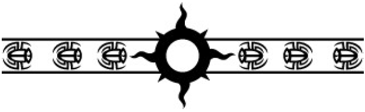

        献给Ant Reynolds; 感谢您成为这本书的第一位读者，以及说服我跨越大西洋山脉\*1，去往美利加\*2,3。

 

\* **机仆注：**

        1. Atlantic Ridge, 显然neta的是Mid-Atlantic Ridge, 一个地理上的概念，大西洋洋中脊。指的是南北向横贯大西洋和北冰洋的大洋中脊 (mid-ocean ridge) ，一种山脉。大洋中脊是板块构造运动的结果，陆地板块于此分离，涌出的岩浆冷却形成新的地壳。在各种海洋类纪录片里是常客（笑），著名的“海底黑烟囱”就处于这种地质构造上。

        2. Merica, 即锤语境下对美洲大陆的称呼。

        3.  据GM《猩红君王》后记，这本书成书于他自英国搬至加州之后。

 

---

 

<h4>
  序幕
</h4>

 

<i> 

        “智慧源自铭记过去、与担负起对未来的责任。”
        

-- 《马格努斯之书》序言

 

        “给我一根足够长的杠杆，还有一个放置它的支点，而我便能撬动整个世界。”

-- 摘自《奥林匹亚诸寓言》

原体佩图拉博语

</i>

  

 

*巫师之星*

*时间未知*

 

        马格努斯认不出这地方。

        至少，不是以它如今的模样认得。

        他记得弗泰普金字塔<a href="#MasterOfProspero-0-1">[1]</a>(the Pyramid of Photep)，一处光华之地，有着抛光的玻璃、眩目的反光与倒影。那里啊，星芒与日光在其下的地面上嬉戏。

        曾经，俊美的人们聚集在它有着金碧辉煌拱顶的中庭，举行着关于伦理、道德和美德的激烈辩论。 他们曾满心愉悦地以为，他们的世界建立在理性、智慧和追求更高真理的原则之上。

        如今，里面冰冷死寂，空无生命，唯余他不敢去注意的低语阴影、与破碎玻璃的倒影。伴着它的那些学会 (Fellowship)*2 金字塔，是焦黑精金 (adamantium)*3 的坍垂废墟，空洞的骨架漂流在一片窒塞于尘埃的荒原上。

        闪电在金字塔群之外的地平线上舞蹈，它们破碎的框架在他周围投下分明锐利的阴影。马格努斯花了一点时间来定下自己的方向。曾经，他明明确确知道该向何处前行，可是，时过境迁。

        金字塔的框架已在燃烧的高温下弯曲。可是，是那将它们从普罗斯佩罗转移到这千变万化的世界上的传送，将它们每一座都扭曲成了这等丑陋得可怖的畸形模样。它们的角度，曾经如此精准，如今非自然地扭曲着，仿佛是在嘲讽着它们完美的形态。

        他仰头望进那回响着的虚空，脑中绘着他与狼王的最后一战。悲楚随着那回忆，井水般涌上心头。两位兄弟，在如此多的方面截然不同，却又在最为基础的本质上如此肖似。这本可何等不同。

        尘埃在马格努斯上方旋舞，凝出了一幅雾霾般朦胧的、那一瞬的形影，而他移开了目光，不愿再次重温他最深的耻辱。他的世界被夷为平地，这是他心中一道永远无法愈合的伤口，而弗泰普金字塔的失损，是那一切伤痕之中，最为深重的一道。

        它是银河中的一大奇迹，是他的至圣之所 (his sanctum sanctorum)，是普罗斯佩罗上一切伟大而高贵之物的象征。它承载着他至珍至伟的瑰宝：文字，那些足以追溯到人类在黏土上刻下第一笔时的文字；那些文字所记载的，盲目的、跌跌撞撞迈入科学与哲学的步伐；那些文字所承载的，伟大的戏剧文学、还有无可替代的艺术作品。

        尽皆失落不复，在一个无可想象的暴力之夜里，一夜之间，焚至尘烬。那个他父亲将芬里斯的群狼释放出柙的夜。

        他们对月高嗥、肆虐。

        他们飨宴饱足。

        可他们失败了，未毕全功。

        马格努斯与他的千子们逃脱了，穿过了浩瀚之洋 (the Great Ocean)*4 那嗥吼的混沌，来到了这疯狂的世界上。他此前从不曾见过这颗行星，从不曾知晓、抑或是猜疑过它的存在，可他知道它的名，就如他知晓他自己的。

        巫师之星。

        一个恰如其分的名，因那力量无拘无缚地奔淌过他每一个尚存的孩子们。

        那或许很快便会将他们尽数毁灭的力量。

        马格努斯在废墟间拣选出一条路来。一位神圣绝美的天使，行走于他罪责的灰烬间。他凡俗肉体的身躯已经折碎在狼王 (the Wolf King) 的膝盖上，可这新的血肉 – 以亚空间物质塑成 – 一如生前一般坚实。可是，这转变又对他的灵魂带来了什么？他又成为了什么？

        他尚还不知道。

        一抹幽魂么？一段回忆，被赋予了形态？

        抑或是，他真实本质最为纯粹的表现？

        废墟残骸窒塞着金字塔内部的空间。书架倒伏如森林中最为高壮的林木。他迈步跨过高耸如塔的倒伏书架，跨过踏碎在芬里斯铁靴下的数据晶体 (data-crystal)。魔法书典的页，一页页苍白如灰烬，在悲风中随风飘荡，颤振如蝶蛾的翅。马格努斯伸手从空中捉下了一页。

        他认出了它。他当然认得了 – 普罗斯佩罗上，没有一卷书籍他记不得的。

        是的，这是一个变异的时世；

        可是人们可以照着自己的意思解释一切事物的原因，

        实际却和这些事物本身的目的完全相反。*5

        由那位夙负盛名的阿尔比亚 (Albia)*6 戏剧家所落笔的诸戏剧之一。可即便在他周围那一切建筑学、数学、与科学的伟作化作的灰烬之间，这一损失也深深打击到了他。伟大的科技之作总有可被重现的一天，可艺术之作是独特的，永远不复再临。

        马格努斯单膝跪下，手指摊展在尘土中，让浩瀚之洋的力量流淌过他的身体。他自他记忆的厅堂里抽提出关于那位古老的言辞匠人 (wordsmith) 技艺的回忆。尘粒般的闪烁金光，萤火虫似的，自灰烬间升了起来。它们在他周围飘荡着，盘旋成一道双螺旋的轨迹，流淌进那一碎纸片里。

        仿佛一场倒放的焚城之火，那纸页重新成形，自损毁复归完整。随着一粒粒光尘集聚在残存的纸页周围，匆匆然凝成一张新造的羊皮纸，马格努斯欢喜地微笑起来。他闭上眼，呼出一口并非真正意义上的呼吸，感受到一阵喜悦。那喜悦 -- 这戏剧那神秘的创造者，当初匆草落笔将这些文字刻入存在时，也一定是感受到了一模一样的喜悦的。马格努斯感到有重量落定在他掌心，睁开了眼。那手稿已然完整，字迹在纸页上闪烁着幽幽的湿润光亮，仿佛刚刚书就。

        “你就打算那样来恢复你失去的一切么？”

        “倘若我必须如此的话。”马格努斯说。

        “没用的。”

        “你又是怎么知道的？”

        “因为我知道你所知道的呀。”那看不见的说话者说道，“而你知道那行不通。可不论如何，你还是会去尝试的。”

        马格努斯站直了身子，转过身去，让记忆为他披挂上他在普罗斯佩罗的最后一日时所穿戴的战甲。打磨光亮的金，饰着弯曲的角；熟皮制成的翼片 (pteruges) *7；还有一头狂野不驯的、狮鬃般的殷红长发，束在一环青铜的带里。

        一位黑袍的身影立在他面前。那身影有着认不错的、一位军团战士的高大身躯。他的双手，手指交错着，交叠在面前、落在腰间；右手中指上，一枚金制的远征军戒指 (Crusader ring) 闪烁着细碎的微芒。他有着一张五官利落分明的英俊面容，黑长的头发素朴地全部向后梳着，蒙在一颗颅顶尖尖的头骨上，令他带上了某些鹰隼似的气质 *8。

        “我已经很长一段时间里没有想起过那张面容了。“马格努斯说着，将一只手栖落在他那本同名典籍的红色皮革封面上。

        “对我说谎，你欺骗的只是你自己。”那军士说道，“记住，我知道你所知道的。”

        “很好。”原体说，“那么，让我们说，我试图不去想起他吧。”

        那身影绕着马格努斯环行，以研究般的目光细细审视着他，仿佛他们是方才重逢的旧相识。这想法并非完全荒谬。

        “他记得他第一次见到你时，你的模样，就是这样。”那军士说，“那时，他几乎就要死了，以为你是一影前来接引他前往彼界的幻象。”

        “我记得，记得很清楚。”马格努斯说道，“我很惊讶他这样。”

        军士张开双手，咧嘴一笑，“也许我记得的是你所记得的、这事情的模样，又或者我是在你那大魔法书的书页间读到了它。不论如何，那时候，他都不是他自己了。那时，你们中，很少有人还是自己。可是，你修整好了他们*，不是么？就像你修整好了我们一样 *9。”

        “我尝试了。”马格努斯说着，向金字塔废墟的更深处走去，“我尝试着拯救我所有的孩子们，尝试得那样狠。”

        军士跟随着他。“我知道。”他说，“可你的治疗比那疾病还要糟。”

        “你以为我不知道么？”马格努斯厉声说道，顺着一条盘旋着的小径，走向一处宽广的弹坑。那弹坑里满是尖刀般的玻璃碎片。“我又有什么选择呢？”

        “你本可以就任由他们死去的。”

        “绝不。他们是我的孩子啊！”

        “可他们现在又是什么了呢？”那身影问着，渐渐走下了弹坑里，“而他们又会成为些什么？看一看浩瀚之洋吧，马格努斯。读一读那未来的潮汐，告诉我，你是否还为他们在那一切将临的世纪复世纪里的所作所为感到骄傲。”

        “不！”马格努斯大喊，跌跌撞撞冲入了弹坑，一切悔恨与羞愧的念头都被愤怒驱散去了一边。玻璃在脚下碎裂开来，万千反射出的倒影凝然回望着他，作着无声的指控。

        没有一片相同，每一碎，都是他灵魂一方他不敢去面对的面相。

        “未来并非注定。”马格努斯说，“荷鲁斯在达文 (Davin) 上落入了相信这一点的陷阱。我不会重蹈覆辙，犯下同样的错误。”

        “不，你会犯下新的。”那身影说着，一根手指轻轻敲了敲额头。马格努斯感到他的目光被吸引着，落定在那军士的金戒指上。镌在金属上的纹样看不分明，可他不需要去看，便知道它是什么，抑或是明晓它所代表的罪愆。

        “你会犯下更糟糕的错误，因为你依然相信着自己可以把一切都修整完好。”军士继续说着，“全能的马格努斯啊 – 他可以拯救每一个人，因他比任何人都要聪明。他知晓再无他人知晓的诸般事物。”

        “你所披着的那张面容呢？他不可能在这里的。”马格努斯说，“我的兄弟在泰拉上杀了他*10。”

        “所以呢？”那军士问道，“你比任何人都知道得更清楚，将我们的灵魂束缚于这存在之中的物质，它的消亡，什么都意味不了。在这样一个世界上，甚至比什么都意味不了来得更没有意义。”

        “我感到他放手松开了他那银色的线 *11。”

        “可是，你才是那切断了丝线的人啊。”军士提醒他道，举起了戒指，好让马格努斯看见镌在它表面的雄鹰、与交叉的闪电，“你才是那个将他派回泰拉以作象徵的人。太过破碎，无法在大远征 (the Great Crusade) 的最前线上服役。”

        “鲁斯 (Russ) 对我造成的破坏比我所想象的要厉害得多。”马格努斯说，“我的思绪都在崩坍散解了。”

        “那之中也是有着真相的，不过你知道我不是你那正在崩解的心灵所创造出来的幻影 *12。我来，是为了携来一则警告的。”

        “一则警告么？”马格努斯说着，向那军士踏去一步，将浩瀚之洋那毁灭性的力量汲在拳中，“你所携负的，是什么警告？”

        “不过是那你已知道的 – 你与之交易的力量，它们跟你、还有你的孩子们，还没完呢。昔日的罪行，尚有代价要支付。”

        马格努斯笑了。一声苦涩的吠笑，沉沉地坠着无止无尽的悔恨与悲伤。

        “原初毁灭者 (the Primordial Annihilator) 又还能从我这里夺走些什么呢？”马格努斯说着，跪倒在地，捧举起一抔破碎的玻璃与尘埃，“野狼们摧毁了我的世界，将我们的知识焚至尘烬！我的孩子们正在死去，而我却无力拯救他们！”

        “赤红的马格努斯，猩红君王 (the Crimson King)*13，无力无助？不，你并不真的相信这一点，否则，你就不会在这里了。”

        一块金属在马格努斯身下露出了一点，反射着晦暗的微光。马格努斯看见了那微光，任由玻璃与尘埃自他手中泼溅而落。

        “还是有一种办法，能够欺瞒你的命运的。”那死去的军士说。

        “何以然？”

        “你记得黎明星 (Morningstar) 么？”

        “是的，阿萨瓦 (Atharva)。”马格努斯说道，“我记得黎明星。”

(序幕 完)

**机仆注：**

 
1. the Pyramid of Photep, 小马的居所。小马的旗舰与之同名，也叫the Photep。Photep一词可能有两重词根 – 希腊语的phot-, “光” ；和古埃及语的 “hotep”, “平和、（为神所）喜悦满意” 。
[\[^\]](#MasterOfProspero-0-1a)

2. Fellowship, 千子特色的指挥单位，约等于其他军团的大连。

3. adamantium, 锤世界观下某种坚硬的材料。

4. the Great Ocean, 即千子和普罗斯佩罗人对亚空间的称呼。随《千子》官译作“浩瀚之洋“，亦有作“伟大汪洋”的。

5. 出自莎剧《凯撒大帝》第一幕 第三场 (Julius Caesar, Act I: Scene 3) ，是西塞罗 (Cicero) 的台词。本处采用的是朱生豪译本。

6. Albia, 40k世界观下对英伦诸岛的称呼。Neta自英国古称Albion. 关于Albion更多剧情及现实生活中的考据，可参考 @DBOA 太太的考据 https://t.bilibili.com/937462683552186372

7. pteruges, 古希腊及罗马铠甲的一部分。一般由织物或皮革制成，一条一条的，通常穿戴在腰间或肩甲上，以作防御。HH小马模型腰间那些松石蓝绿的条条就是这个。词源是古希腊语 πτέρυγες (ptéruges)， “羽毛” 的意思。

上文所描述的，HH小马的模样。这一身可精致了，就是FW树脂实在过于修模地狱，以至于我手头那只HH小马躺了一年多，至今还没开工…
左下那些松石绿的就是pteruges

8. 这个身影所采用的外形是阿萨瓦的 – 但并不是阿萨瓦，并且小马也知道他不是。阿萨瓦是千子的大远征代表 (the Crusader Host) ，出场在GM的另一本小说《流浪弃儿》the Outcast Dead 里。荷鲁斯反叛后，他和其他军团的大远征代表一起被关押进了禁军看守的监牢，后同其他军团代表一起，携承载着小马对未来之推演警告的星语者越狱出奔。他的故事简述和考据参见CV23175067。

9. 原文都是fixed，为了照应原文的相同用词，暂时只好先这样处理。第一处更接近于“治好了”，但第二处是指的小马最后对黎明星所做的，恐怕很难用“治疗”来形容…

10. 即《流浪弃儿》(25) CV18823688，多恩亲手击毙了试图出奔的阿萨瓦。

11. 参见本书后续章节和《被抹杀的第六学派》。初学遨游浩瀚之洋时，有银色的丝线将灵魂与肉体相连，以确保灵魂还能返回 – 灵魂回不来的话人就没了。潜台词是小马知道阿萨瓦彻底死了。

12. 这里是呼应《猩红君王》里的说法。狼王那一下 – 也可能是将剩余千子转移到巫师星的交易 -- 打碎了小马的灵魂。小马当时灵魂破碎，残存在巫师星上的部分已经不足以维持他的稳定存在，他的记忆和存在本身在不断流淌进浩瀚之洋。

13. 其实crimson更接近“绯”“殷”一类的概念，是深沉浓厚、略偏紫的红。但官中翻译成“猩红君王”了，还是遵照官中比较好。此外，官中翻译成“猩红君王”应该是有文化语境原因的 – 详见@DBOA太太的色彩学考据，https://t.bilibili.com/866052676056514561
